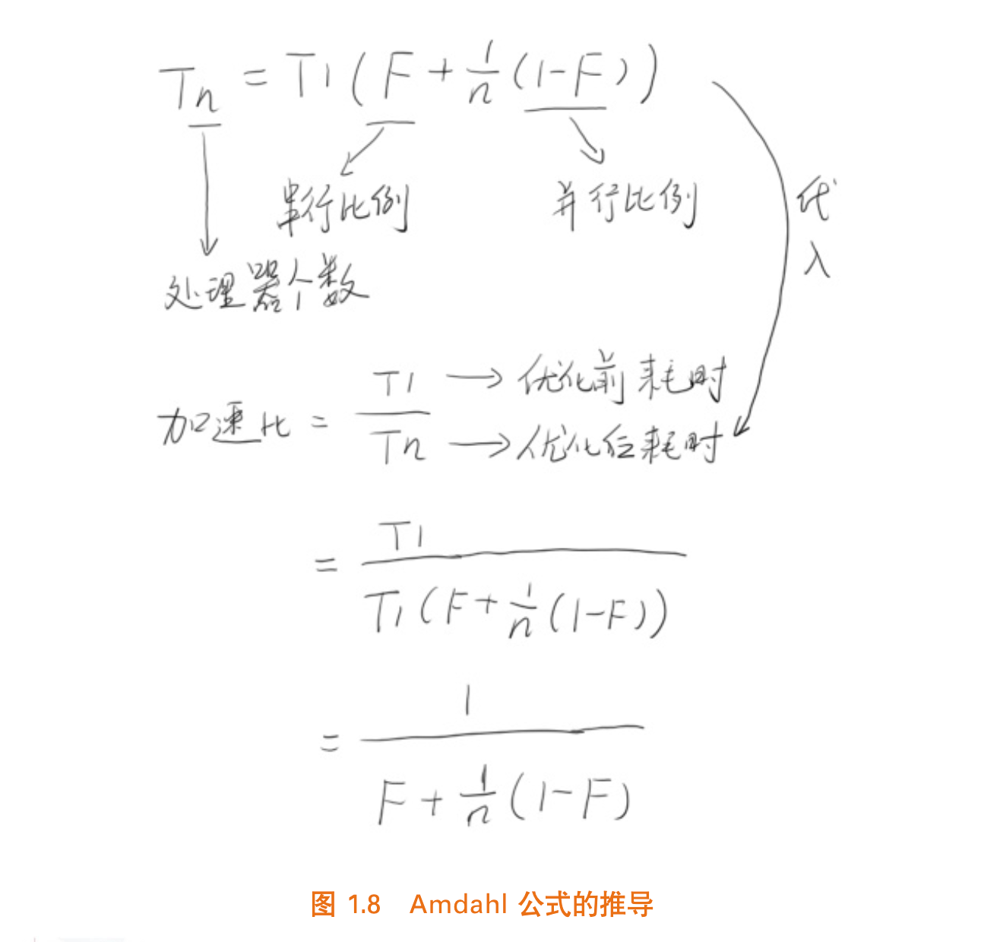
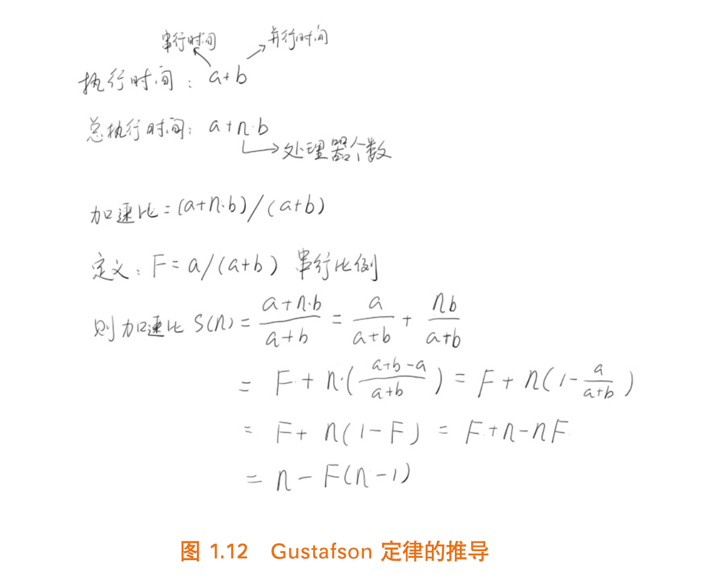
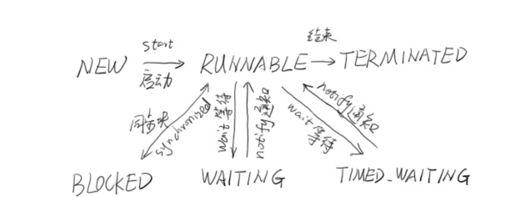
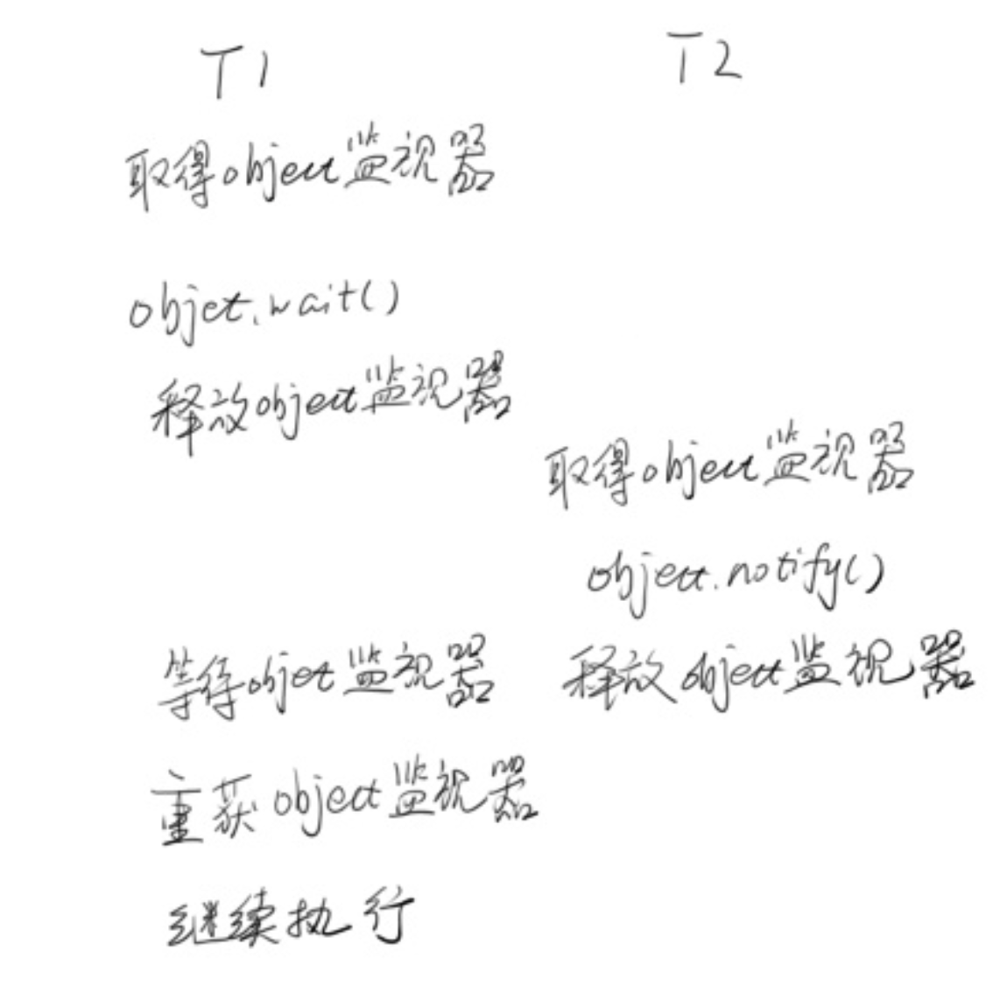

# 第一章 走入并行世界

## 1. 何去何从的并行计算（略读）

### 1. 忘掉那该死的并行

### 2. 摩尔定律失效

### 3. 柳暗花明：多核

### 4. 光明或者黑暗

## 2. 必须知道的概念

### 1. 同步和异步

1. 通常用来形容一次方法调用
2. **<u>同步方法</u>**一旦开始，调用者必须等到方法调用返回后，才能继续后续的行为。
3. 异步方法更像一个消息传递，一旦开始方法立即返回，调用者继续后续操作。异步方法在另一个线程中“真正”的执行。

### 2. 并发和并行

1. 并发偏重于多个任务交替执行，而并行是真正意义上的同时执行；

### 3. 临界区

1. 用来表示一种**公共资源**或者说**共享数据**，可以被多个线程使用。但是每次只能有一个线程使用。

### 4. 阻塞和非阻塞

1. 形容多线程中的相互影响。
2. 非阻塞：所有线程都会尝试不断向前执行，不会妨碍其他线程执行。
3. 阻塞：可能因为资源占用导致的等待，线程挂起，称为阻塞。

### 5. 死锁、饥饿和活锁

1. 饥饿：指的是一个线程因为某种原因一直获取不到需要的资源，导致一直无法执行。不过还是有一定可能在未来执行的。比死锁好点。
2. 活锁：线程“谦让”资源，主动释放给他人，导致资源不断的在线程间跳动，而么有一个线程可以同时拿到所有的资源正常执行。

## 3. 并发级别

### 1. 阻塞

1. 一个线程是阻塞的，那么在其他线程释放资源之前，当前线程无法继续执行。当我们使用synchronized或者重入锁时得到的就是阻塞的线程。

### 2. 无饥饿

1. 如果线程之间有优先级，公平锁不允许高优先级的插队，按照先来后到的顺序，不会产生饥饿。

### 3. 无障碍

1. 不会因为临界区阻塞， 如果大家同时修改导致数据坏掉，一旦检测到，他会立即对数据回滚保证数据安全；如果没有数据竞争则线程顺利完成自己的工作。
2. 无障碍也不一定好使：如果存在严重冲突，所有的线程不断回滚，影响系统运行。我们至少需要保证一个线程能够在有限时间内完成自己的操作。
3. **<u>一致性标记</u>**：线程在操作之前，先读区并保存这个标记，在操作完成后再次读区，检查是否被更改过。如果是一致的表示资源访问没有冲突，如果不一致说明资源可能与其他线程产生写冲突，需要重试操作。而任何线程在对资源有修改操作，修改前需要更新一致性标记表示数据不再安全。

### 4. 无锁

1. 无锁的并行都是无障碍的。但是无锁可以保证有一个线程在有限步骤内完成操作离开临界区。

2. 无锁的调用过程中，典型的特点是可能包含**<u>无限循环</u>**，e.g. 

    * ```java
        while (!atomicVar.compareAndSet(localVal, localVar + 1)) {
        		localVal = atomicVal.get();
        }
        ```

        如果修改不成功，循环永远不会停止。

### 5. 无等待

1. 要求所有的线程都必须在有限步内完成，就不会引起饥饿。
2. 一个典型的无等待结构：**<u>RCU</u>**（Read Copy Update）：对数据的读可以不加控制，这样所有的读线程都是无等待的，他们既不会被锁定也不会引起任何冲突。但在写数据的时候，先去的原始数据的副本，接着只修改副本数据，修改完成后在合适的时机写回。

## 4. 有关并行的两个重要定律

### 1. Amdahl定律

1. **<u>定义了串行系统并行化后加速比。加速比 = 优化前的系统耗时 / 优化后系统耗时</u>**。
2. 推导
    * 

* 如果CPU数量无穷大， 加速比与系统的串行化比例成反比。另一方面也显示仅增加CPU数量也不一定起到有效作用，还可以**<u>减少串行比例</u>**，提高系统可并行化模块的比例。

### 2. Gustafson定律

1. 也是试图说明处理器个数，串行化比例和加速比之间的关系，但是和Amdahl定律角度不同。
2. 推导
    * 

### 3. 是否矛盾？

1. Amdahl强调：**<u>当串行化比例一定时，加速比是有上限的。</u>**

2. <u>Gusafson强调：**如果可被并行化的代码所占比例足够大，加速比就可以随着CPU数量线性增长。**</u>

## 5. 回到Java：JMM

### 1. **<u>原子性</u>**：一个操作不可中断

1. 使用int型数据同时两个线程为他赋值：A线程赋值1，B线程赋值-1，任何时候任何步调他的值都是1或者-1；
2. 但是long型，（64位类型在32位系统中的读写都不是原子性的，多线程之间互相干扰）得到的结果就不是。

### 2. <u>**可见性**</u>： 当一个线程修改了某一个共享变量的值，其他线程是否立即可见。

### 3. <u>**有序性**</u>：存在指令重排序导致和原指令顺序不一致。

### 4. 一条指令的执行可能为了**性能**重排

1. 指令执行步骤：取指（IF）、译码和取寄存器操作数（ID）、执行或者有效地址计算（EX）、存储器访问（MEM）、写回（WB）
2. **<u>指令流水线。</u>**
    * 

3. 指令重排序过程

### 5. 哪些不可以重排序：Happen-Before规则

# Java并行程序基础

## 1. 有关线程你必须知道的事

1. 进程

    1. 状态

        * 

        * blocked和wait区别
            * wait等待分配处理时间片
            * block无法获得资源

## 2. 初始线程：线程的基本操作

### 1. 新建线程

1. start() 方法新建一个线程并让这个线程执行run方法

2. run()，不要直接调用，只会在当前线程直接串行执行run中的代码；

    1. 默认状态啥都没做，需要重写将任务填进去

        1. ```java
            public class ThreadTest {
                public static void main(String[] args) {
                    Thread t1 = new Thread() {
                        @Override
                        public void run() {
                            System.out.println("hello thread");
                        }
                    };
                    t1.start();
                }
            }
            ```

    2. 一般来说继承Thread重写run即可，但是Java是单继承，继承比较宝贝，也可以使用runnable接口实现同样的操作；

        1. ```java
            public class ThreadTest implements Runnable {
                public static void main(String[] args) {
                    Thread t1 = new Thread(new ThreadTest());
                    t1.start();
                }
            
                @Override
                public void run() {
                    System.out.println("interface create thread");
                }
            }
            ```

### 2. 终止线程

1. stop()即将废弃也许，因为直接马上停止线程，释放所有的锁，会引起一些数据不一致的问题。

    1. e.g.比如一个写线程写到一半被终止，锁都释放了，另一个线程马上读取到了写了一半的数据，就会引起不一致。

    2. ```java
        package COM;
        
        public class StopThreadSafe {
            public static User u = new User();
            public static class User {
                private int id;
                private String name;
                public User() {
                    id = 0;
                    name = "0";
                }
        
                public int getId() {
                    return id;
                }
        
                public void setId(int id) {
                    this.id = id;
                }
        
                public String getName() {
                    return name;
                }
        
                public void setName(String name) {
                    this.name = name;
                }
        
                public String toString() {
                    return "User [id=" + id + ", name=" + name + "]";
                }
            }
            public static class ChangeObjectThread extends Thread {
                @Override
                public void run() {
                    while (true) {
                        synchronized (u) {
                            int v = (int)(System.currentTimeMillis()/1000);
                            u.setId(v);
                            // do sth
                            try {
                                Thread.sleep(100);
                            } catch (InterruptedException e) {
                                e.printStackTrace();
                            }
                            u.setName(String.valueOf(v));
                        }
                        Thread.yield();
                    }
                }
            }
        
            public static class ReadObjectThread extends Thread {
                @Override
                public void run() {
                    while (true) {
                        synchronized (u) {
                            if (u.getId() != Integer.parseInt(u.getName())) {
                                System.out.println(u.toString());
                            }
                        }
                        Thread.yield();
                    }
                }
            }
        
            public static void main(String[] args) throws InterruptedException {
                new ReadObjectThread().start();
                while (true) {
                    Thread t = new ChangeObjectThread();
                    t.start();
                    Thread.sleep(150);
                    t.stop();
                }
            }
        }
        ```

        会得到如下结果：

        User [id=1638453433, name=1638453432]
        User [id=1638453435, name=1638453434]

    3. 如果要停止一个线程，我们自行决定如何退出即可。改动上面代码，向ChangeObjectThread增加一个stopMe()方法： 

        1. ```java
            public static class ChangeObjectThread extends Thread {
                    volatile boolean stopme = false;
            
                    public void stopMe() {
                        stopme = true;
                    }
            
                    @Override
                    public void run() {
                        while (true) {
                            if (stopme) {
                                System.out.println("exit bu stop me");
                                break;
                            }
                            synchronized (u) {
                                int v = (int)(System.currentTimeMillis()/1000);
                                u.setId(v);
                                // do sth
                                try {
                                    Thread.sleep(100);
                                } catch (InterruptedException e) {
                                    e.printStackTrace();
                                }
                                u.setName(String.valueOf(v));
                            }
                            Thread.yield();
                        }
                    }
                }
            ```

            当stopMe()被调用，stopme被设置为true，当条件语句检测到这个变动，就自动退出了。

### 3. 线程中断

1. 线程中断并不会使线程立即退出，而是给线程发送一个通知，告诉他有人希望他退出了。

    1. 有三个方法需要辨析：

        1. ```java
            public void Thread.interrupt() 					// 中断线程
            public boolean Thread.isInteruppted()		// 判断是否被中断
            public static Thread.interrupted()			// 判断是否被中断，并清除当前中断状态
            ```

        2. 如果希望线程在中断后退出，就必须为他增加相应的中断处理代码

        3. Thread.sleep()会让线程休眠若干时间，他会抛出一个InterruptException，因为他不是个运行时异常所以程序必须捕获他，中断的时候他会清除中断标记，需要做进一步处理；

            1. ```public static native void sleep(long millis) throws InterruptedException```

### 4. 等待和通知

1. 函数签名：

    1. ```java
        public final void wait() throws InterruptedException
        public final native void notify()
        ```

    2. 当一个方法调用了obj.wait方法，他就会在当前对象等待。当obj.notify方法被调用，他就会在这个排序等待队列中随机选择一个线程，这个过程是不公平的；

    3. Object.wait()必须在synchronized中调用，需要先获得一个监视器：

        1. 

        2. ```java
            package COM;
            
            public class SimpleWN {
                final static Object object = new Object();
                public static class T1 extends Thread {
                    public void run() {
                        synchronized (object) {
                            System.out.println(System.currentTimeMillis() + ":T1 start!");
                            try {
                                System.out.println(System.currentTimeMillis() + ":T1 wait for object!");
                                object.wait();
                            } catch (InterruptedException e) {
                                e.printStackTrace();
                            }
                            System.out.println(System.currentTimeMillis() + ":T1 end!");
                        }
                    }
                }
            
                public static class T2 extends Thread {
                    public void run() {
                        synchronized (object) {
                            System.out.println(System.currentTimeMillis() + ":T2 start! notify one thread");
                            object.notify();
                            System.out.println(System.currentTimeMillis() + ":T2 end!");
                            try {
                                Thread.sleep(2000);
                            } catch (InterruptedException e) {
                            }
            
                        }
                    }
                }
            
                public static void main(String[] args) {
                    Thread t1 = new T1();
                    Thread t2 = new T2();
                    t1.start();
                    t2.start();
                }
            }
            ```

            输出 

            ```
            1638618843003:T1 start!
            1638618843004:T1 wait for object!
            1638618843004:T2 start! notify one thread
            1638618843004:T2 end!
            1638618845006:T1 end! // 注意时间戳差了两秒，他t2休眠了
            ```

        3. wait和sleep，除了wait可以被唤醒，wait还会释放资源的锁，sleep没有

### 5. 挂起和继续执行

1. suspend和resume是一对，但是目前现实已经废弃，因为存在resume因为某些原因提前于suspend执行，导致suspend等不到它，而不会释放任何锁资源，导致整个现场状态还是 runnable但是已经进入了一种类似死锁的状态。

### 6. 等待线程结束和谦让

1. join：一个线程需要等待依赖线程执行完毕

    1. e.g.主线程等着AddThread执行完再一起走

        ```java
        package COM;
        
        public class JoinMain {
            public volatile static int i = 0;
            public static class AddThread extends Thread {
                @Override
                public void run() {
                    for (i = 0; i < 10000000; i++);
                }
            }
        
            public static void main(String[] args) throws InterruptedException {
                AddThread at = new AddThread();
                at.start();
                at.join();
                System.out.println(i);
            }
        }
        ```

    2. join方法本质上是调用额wait方法，当线程执行完毕后，再执行notifyAll让所有等待线程继续执行；所以不要再应用程序中使用类似wait或者notify方法，会搞乱系统API。

2. yield：执行后让当前线程让出CPU，然后和其他的线程又再去竞争，可能你觉得他没那么重要，可能占用多CPU，在适当的时候调用它给其他人一些机会。

## 3. volatile与Java内存模型

1. 可以保证原子性、可见性和顺序性，他只能确保在某个线程修改某个数据值后其他线程可以马上看到，但是当两个线程同时修改时，依然可以产生冲突。
2. 但是不能代替锁，e.g.i++操作。

## 4. 分门别类的管理：线程组

1. 在同一个系统中，如果线程数量很多，而且功能分配比较明确，就可以将相同功能的线程放置在同一个线程组里。

2. ```java
    package COM;
    
    public class ThreadGroupName implements Runnable{
        public static void main(String[] args) {
            ThreadGroup tg = new ThreadGroup("Printgroup");
            Thread t1 = new Thread(tg, new ThreadGroupName(), "T1");
            Thread t2 = new Thread(tg, new ThreadGroupName(), "T2");
            t1.start();
            t2.start();
            System.out.println(tg.activeCount()); // 当前一刻的活跃线程数
            tg.list(); 														// 本线程组中所有线程信息
        }
    
    
        @Override
        public void run() {
            String groupAndName = Thread.currentThread().getThreadGroup().getName()
                    + "-" + Thread.currentThread().getName();
            while (true) {
                System.out.println("I am " + groupAndName);
                try {
                    Thread.sleep(2000);
                } catch (InterruptedException e) {
                    e.printStackTrace();
                }
            }
        }
    }
    ```

## 5. 守护线程 Deamon

1. 当Java应用内只有守护线程时候，JVM就会退出

## 6. 线程优先级

## 7. 线程安全和synchronized关键字

1. synchronized实现线程间的同步，对同步代码加锁
    1. **执行加锁对象**
    2. **直接作用于实例方法**
    3. **直接作用于静态方法**

## 8. 隐蔽的错误

### 1. 无提示错误的案例

1. ```java
    package COM;
    
    public class HiddenError {
        public static void main(String[] args) {
            int v1 = 1077777777;
            int v2 = 1433333333;
            System.out.println("v1=" + v1);
            System.out.println("v2=" + v2);
            int ave = (v1 + v2) / 2; 								// 输出ave=-891928093，溢出错误
            System.out.println("ave="+ ave);
        }
    }
    ```

### 2. 并发下的ArrayList

1. ```java
    package COM;
    
    import java.util.ArrayList;
    
    public class ArrayListMultiThread {
        static ArrayList<Integer> al = new ArrayList<>(10);
        public static class AddThread implements Runnable  {
    
            @Override
            public void run() {
                for (int i = 0; i < 1000000; i++) {
                    al.add(i);
                }
            }
        }
    
        public static void main(String[] args) throws InterruptedException {
            Thread t1 = new Thread(new AddThread());
            Thread t2 = new Thread(new AddThread());
            t1.start();
            t2.start();
            t1.join(); t2.join();
            System.out.println(al.size());
        }
    }
    ```

2. 可能出现三种结果

    1. 正确输出2000000
    2. 抛出异常，再扩容过程中，内部一致性被破坏，没有锁的保护，另外一个线程访问到了不一致的内容，导致出现越界
    3. 打印了一个比2000000小的数字，多个线程读取保存数组容量大小的值，同时可能对同样一个位置赋值，都会导致这个结果。

3. 改善：使用**<u>Vector</u>**

### 3. 并发下hashmap

1. 访问也有可能出现三种
    1. 正确结果
    2. 较小结果
    3. 死循环：因为多线程的冲突导致链表结构遭到破坏，成环了（e.g. 例如两个节点互为对方的next元素）
        1. JDK8缓解了这个问题
2. 改善：可以用**<u>concurrentHashMap</u>**解决

### 4. 初学者错误的加锁

1. ```java
    package COM;
    
    public class BadLockOnInteger implements Runnable {
        public static Integer i = 0;
        static BadLockOnInteger instance = new BadLockOnInteger();
    
        @Override
        public void run() {
            for (int i = 0; i < 1000000; i++) {
                synchronized (i) {
                    i++;
                }
            }
        }
    
        public static void main(String[] args) throws InterruptedException {
            Thread t1 = new Thread(instance);
            Thread t2 = new Thread(instance);
            t1.start(); t2.start();
            t1.join(); t2.join();
            System.out.println(i);
        }
    }
    ```

2. 实际结果却不是200000！

    1. Integer属于不变对象，每次增加操作都会新建一个对象。
        1. i++本质是创建一个新的Integer对象，并且将他的引用值赋值给i： ```i = Integer.valueOf(i.intValue() + 1); ```
    2. 因为i每次都在变，所以多线程看到的可能不是同一个对象，锁加在不同的对象身上，导致对临界区代码控制出现问题
    3. 改正：```synchronized (i)```改为```synchronized (instance)```


# 第三章 JDK并发包

# 第四章 锁的优化及注意事项

# 第五章 并行模式与算法

# 第六章Java 8、9、10与并发

## 1. Java8的函数式编程简介

## 2. 函数式编程基础

## 3. 走入函数式编程

## 4. 并行流与并行排序（Skip）

## 5. CompletableFuture（Skip）

## 6. 读写锁的改进：StampedLock（Skip）

## 7. 原子类的增强（Skip）

## 8. ConcurrentHashMap的增强（Skip）

## 9. 发布与订阅模式（Skip）

# 第七章 使用Akka构建高并发程序（Skip）

# 第八章 并行程序调试（Skip）

# 第九章 多线程优化实例：Jetty核心源码分析


