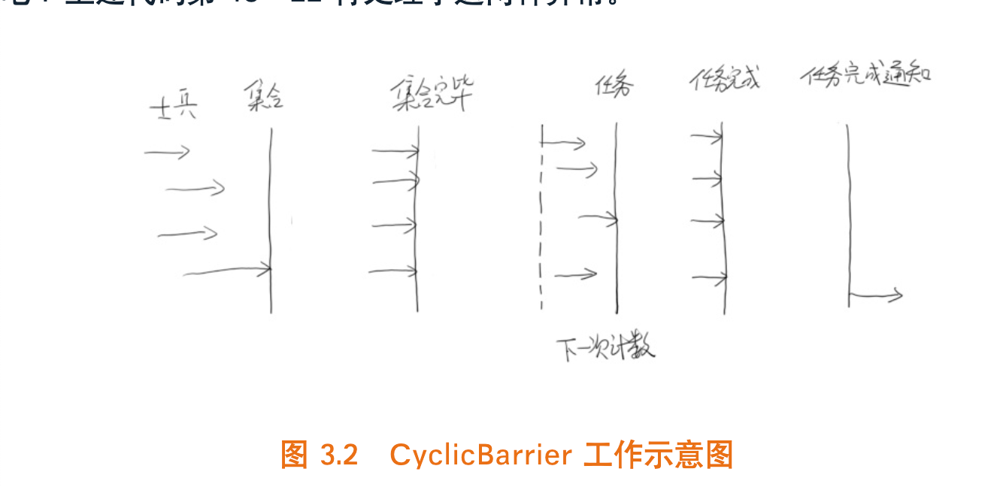

# 第一章 走入并行世界

## 1. 何去何从的并行计算（略读）

### 1. 忘掉那该死的并行

### 2. 摩尔定律失效

### 3. 柳暗花明：多核

### 4. 光明或者黑暗

## 2. 必须知道的概念

### 1. 同步和异步

1. 通常用来形容一次方法调用
2. **同步方法**一旦开始，调用者必须等到方法调用返回后，才能继续后续的行为。
3. 异步方法更像一个消息传递，一旦开始方法立即返回，调用者继续后续操作。异步方法在另一个线程中“真正”的执行。

### 2. 并发和并行

1. 并发偏重于多个任务交替执行，而并行是真正意义上的同时执行；

### 3. 临界区

1. 用来表示一种**公共资源**或者说**共享数据**，可以被多个线程使用。但是每次只能有一个线程使用。

### 4. 阻塞和非阻塞

1. 形容多线程中的相互影响。
2. 非阻塞：所有线程都会尝试不断向前执行，不会妨碍其他线程执行。
3. 阻塞：可能因为资源占用导致的等待，线程挂起，称为阻塞。

### 5. 死锁、饥饿和活锁

1. 饥饿：指的是一个线程因为某种原因一直获取不到需要的资源，导致一直无法执行。不过还是**有一定可能在未来执行**的。比死锁好点。
2. 活锁：线程“谦让”资源，**主动释放**给他人，导致资源不断的在线程间跳动，而么有一个线程可以同时拿到所有的资源正常执行。

## 3. 并发级别

### 1. 阻塞

一个线程是阻塞的，那么在其他线程释放资源之前，当前线程无法继续执行。当我们使用**synchronized**或者**重入锁**时得到的就是阻塞的线程。

### 2. 无饥饿

如果线程之间有优先级，公平锁不允许高优先级的插队，按照先来后到的顺序，不会产生饥饿。

### 3. 无障碍

1. 不会因为临界区阻塞， 如果大家同时修改导致数据坏掉，一旦检测到，他会立即对数据回滚保证数据安全；如果没有数据竞争则线程顺利完成自己的工作。
2. 无障碍也不一定好使：如果存在严重冲突，所有的线程不断回滚，影响系统运行。我们至少需要保证一个线程能够在有限时间内完成自己的操作。
3. **<u>一致性标记</u>**：线程在操作之前，先读取并保存这个标记，在操作完成后再次读取，检查是否被更改过。如果是一致的表示资源访问没有冲突，如果不一致说明资源可能与其他线程产生写冲突，需要重试操作。而任何线程在对资源有修改操作，修改前需要更新一致性标记表示数据不再安全。

### 4. 无锁

1. 无锁的并行都是无障碍的。但是无锁可以保证有一个线程在有限步骤内完成操作离开临界区。

2. 无锁的调用过程中，典型的特点是可能包含**<u>无限循环</u>**，e.g. 

    ```java
    while (!atomicVar.compareAndSet(localVal, localVar + 1)) {
    		localVal = atomicVal.get();
    }
    ```

    如果修改不成功，循环永远不会停止。

### 5. 无等待

1. 要求所有的线程都必须在有限步内完成，就不会引起饥饿。
2. 一个典型的无等待结构：**<u>RCU</u>**（Read Copy Update）：对数据的读可以不加控制，这样所有的读线程都是无等待的，他们既不会被锁定也不会引起任何冲突。但在写数据的时候，先去的原始数据的副本，接着只修改副本数据，修改完成后在合适的时机写回。

## 4. 有关并行的两个重要定律

### 1. Amdahl定律

1. **<u>定义了串行系统并行化后加速比。加速比 = 优化前的系统耗时 / 优化后系统耗时</u>**。

2. 推导
   
    

* 如果CPU数量无穷大， 加速比与系统的串行化比例成反比。另一方面也显示仅增加CPU数量也不一定起到有效作用，还可以**<u>减少串行比例</u>**，提高系统可并行化模块的比例。

### 2. Gustafson定律

1. 也是试图说明处理器个数，串行化比例和加速比之间的关系，但是和Amdahl定律角度不同。

2. 推导
   
    

### 3. 是否矛盾？

1. Amdahl强调：**<u>当串行化比例一定时，加速比是有上限的。</u>**

2. <u>Gusafson强调：**如果可被并行化的代码所占比例足够大，加速比就可以随着CPU数量线性增长。**</u>

## 5. 回到Java：JMM

### 1. **<u>原子性</u>**：一个操作不可中断

1. 使用int型数据同时两个线程为他赋值：A线程赋值1，B线程赋值-1，任何时候任何步调他的值都是1或者-1；
2. 但是long型（64位类型在32位系统中的读写都不是原子性的，多线程之间互相干扰）得到的结果就不是。

### 2. <u>**可见性**</u>： 当一个线程修改了某一个共享变量的值，其他线程是否立即可见。

### 3. <u>**有序性**</u>：存在指令重排序导致和原指令顺序不一致。

### 4. 一条指令的执行可能为了**性能**重排

1. 指令执行步骤：取指（IF）、译码和取寄存器操作数（ID）、执行或者有效地址计算（EX）、存储器访问（MEM）、写回（WB）

2. **指令流水线。**
   
    
    
3. 指令重排序过程

### 5. 哪些不可以重排序：Happen-Before规则

- 程序顺序原则：一个线程内保证语义的串行性
- volatile规则：volatile变量的写先于读
- 锁规则：解锁在之后的加锁前
- 传递性：A先于B，B先于C，则A必然在C前
- 线程的start()方法先于它的其他动作
- 线程的所有操作先于终结
- 线程的中断先于被中断的代码
- 对象的构造函数执行、结束先于finalize()方法

# Java并行程序基础

## 1. 有关线程你必须知道的事

1. 进程

    1. 线程：进程是线程的容器，线程是轻量级进程，是程序执行的最小单位，使用多线程而不用多进程去进行并发程序设计是因为线程间的切换和调度的成本远远的小于进程。
    2. 状态
        1. 新建线程：通过new关键字创建一个线程对象，此时线程处于NEW状态，等到线程start()方法被调用时，会让这个线程的run方法执行，线程执行时处于RUNNABLE状态，表示线程所需一切资源都准备好了。
        2. 终止线程：使用stop()方法可以将线程终止，已被废弃可能引起数据不一致性，不推荐使用。
        3. 线程中断：intertupt()中断线程，isInterrupted()判断线程是否被中断，interrupted()判断是否被中断并清除当前中断标志。
        4. 等待和通知：wait()方法被调用以后，当前线程在这个对象上等待，notify()方法调用会从等待队列中随机唤醒一个线程，这两个方法都属于object类，这两个方法的使用必须包含在synchronized语句中，都得先获得对象监视器。
        5. wait()方法和sleep()方法的区别：wait方法可以被唤起，sleep不能。wait方法会释放目标对象的锁，sleep方法不释放任何资源。
        6. 挂起和继续执行：suspend挂起方法使线程暂停的同时不会释放任何资源，直到resume操作被挂起的线程才能继续，这两个方法已经被废弃不推荐使用。
        7. 等待线程结束：join()阻塞在当前线程，直到目标线程执行完毕。
        8. 谦让：yield()方法使线程让出CPU可以给其他线程一些机会，自己参与下一次竞争中。
    
    
    
    
    3. blocked和wait区别
        1. wait等待分配处理时间片
        2. block无法获得资源

## 2. 初始线程：线程的基本操作

### 1. 新建线程

1. start() 方法新建一个线程并让这个线程执行run方法

2. run()，不要直接调用，只会在当前线程直接串行执行run中的代码；

    1. 默认状态啥都没做，需要重写将任务填进去

        ```java
        public class ThreadTest {
            public static void main(String[] args) {
                Thread t1 = new Thread() {
                    @Override
                    public void run() {
                        System.out.println("hello thread");
                    }
                };
                t1.start();
            }
        }
        ```

    2. 一般来说继承Thread重写run即可，但是Java是单继承，继承比较宝贝，也可以使用runnable接口实现同样的操作；

        ```java
        public class ThreadTest implements Runnable {
            public static void main(String[] args) {
                Thread t1 = new Thread(new ThreadTest());
                t1.start();
            }
        
            @Override
            public void run() {
                System.out.println("interface create thread");
            }
        }
        ```

### 2. 终止线程

1. stop()即将废弃也许，因为直接马上停止线程，释放所有的锁，会引起一些数据不一致的问题。

    1. e.g. 比如一个写线程写到一半被终止，锁都释放了，另一个线程马上读取到了写了一半的数据，就会引起不一致。

        ```java
        package COM;
        
        public class StopThreadSafe {
            public static User u = new User();
            public static class User {
                private int id;
                private String name;
                public User() {
                    id = 0;
                    name = "0";
                }
        
                public int getId() {
                    return id;
                }
        
                public void setId(int id) {
                    this.id = id;
                }
        
                public String getName() {
                    return name;
                }
        
                public void setName(String name) {
                    this.name = name;
                }
        
                public String toString() {
                    return "User [id=" + id + ", name=" + name + "]";
                }
            }
            public static class ChangeObjectThread extends Thread {
                @Override
                public void run() {
                    while (true) {
                        synchronized (u) {
                            int v = (int)(System.currentTimeMillis()/1000);
                            u.setId(v);
                            // do sth
                            try {
                                Thread.sleep(100);
                            } catch (InterruptedException e) {
                                e.printStackTrace();
                            }
                            u.setName(String.valueOf(v));
                        }
                        Thread.yield();
                    }
                }
            }
        
            public static class ReadObjectThread extends Thread {
                @Override
                public void run() {
                    while (true) {
                        synchronized (u) {
                            if (u.getId() != Integer.parseInt(u.getName())) {
                                System.out.println(u.toString());
                            }
                        }
                        Thread.yield();
                    }
                }
            }
        
            public static void main(String[] args) throws InterruptedException {
                new ReadObjectThread().start();
                while (true) {
                    Thread t = new ChangeObjectThread();
                    t.start();
                    Thread.sleep(150);
                    t.stop();
                }
            }
        }
        ```

        会得到如下结果：

        User [id=1638453433, name=1638453432]
        User [id=1638453435, name=1638453434]

    3. 如果要停止一个线程，我们自行决定如何退出即可。改动上面代码，向ChangeObjectThread增加一个stopMe()方法： 

        ```java
        public static class ChangeObjectThread extends Thread {
                volatile boolean stopme = false;
        
                public void stopMe() {
                    stopme = true;
                }
        
                @Override
                public void run() {
                    while (true) {
                        if (stopme) {
                            System.out.println("exit by stop me");
                            break;
                        }
                        synchronized (u) {
                            int v = (int)(System.currentTimeMillis()/1000);
                            u.setId(v);
                            // do sth
                            try {
                                Thread.sleep(100);
                            } catch (InterruptedException e) {
                                e.printStackTrace();
                            }
                            u.setName(String.valueOf(v));
                        }
                        Thread.yield();
                    }
                }
            }
        ```

        当stopMe()被调用，stopme被设置为true，当条件语句检测到这个变动，就自动退出了。

### 3. 线程中断

1. 线程中断并不会使线程立即退出，而是给线程发送一个通知，告诉他有人希望他退出了。

    有三个方法需要辨析：

    ```java
    public void Thread.interrupt() 					// 中断线程
    public boolean Thread.isInteruppted()		// 判断是否被中断
    public static Thread.interrupted()			// 判断是否被中断，并清除当前中断状态
    ```

    1. 如果希望线程在中断后退出，就必须为他增加相应的中断处理代码

    2. Thread.sleep()会让线程休眠若干时间，他会抛出一个InterruptException，因为他不是个运行时异常所以程序必须捕获他，中断的时候他会清除中断标记，需要做进一步处理；

        ```java
        public static native void sleep(long millis) throws InterruptedException
        ```

### 4. 等待和通知

函数签名：

```java
public final void wait() throws InterruptedException
public final native void notify()
```

1. 当一个方法调用了obj.wait方法，他就会在当前对象等待。当obj.notify方法被调用，他就会在这个排序等待队列中随机选择一个线程，这个过程是不公平的；

2. Object.wait()必须在synchronized中调用，需要先获得一个[监视器](https://www.cnblogs.com/noteless/p/10394054.html)：

    

    ```java
    package COM;
    
    public class SimpleWN {
        final static Object object = new Object();
        public static class T1 extends Thread {
            public void run() {
                synchronized (object) {
                    System.out.println(System.currentTimeMillis() + ":T1 start!");
                    try {
                        System.out.println(System.currentTimeMillis() + ":T1 wait for object!");
                        object.wait();
                    } catch (InterruptedException e) {
                        e.printStackTrace();
                    }
                    System.out.println(System.currentTimeMillis() + ":T1 end!");
                }
            }
        }
    
        public static class T2 extends Thread {
            public void run() {
                synchronized (object) {
                    System.out.println(System.currentTimeMillis() + ":T2 start! notify one thread");
                    object.notify();
                    System.out.println(System.currentTimeMillis() + ":T2 end!");
                    try {
                        Thread.sleep(2000);
                    } catch (InterruptedException e) {
                    }
                }
            }
        }
    
        public static void main(String[] args) {
            Thread t1 = new T1();
            Thread t2 = new T2();
            t1.start();
            t2.start();
        }
    }
    ```

    输出 

    ```
    1638618843003:T1 start!
    1638618843004:T1 wait for object!
    1638618843004:T2 start! notify one thread
    1638618843004:T2 end!
    1638618845006:T1 end! // 注意时间戳差了两秒，他t2休眠了
    ```

    wait和sleep，除了wait可以被唤醒，wait还会释放资源的锁，sleep没有

### 5. 挂起和继续执行

suspend和resume是一对，但是目前现实已经废弃，因为存在resume因为某些原因提前于suspend执行，导致suspend等不到它，而不会释放任何锁资源，导致整个现场状态还是 runnable但是已经进入了一种类似死锁的状态。

### 6. 等待线程结束和谦让

1. join：一个线程需要等待依赖线程执行完毕

    1. e.g.主线程等着AddThread执行完再一起走

        ```java
        package COM;
        
        public class JoinMain {
            public volatile static int i = 0;
            public static class AddThread extends Thread {
                @Override
                public void run() {
                    for (i = 0; i < 10000000; i++);
                }
            }
        
            public static void main(String[] args) throws InterruptedException {
                AddThread at = new AddThread();
                at.start();
                at.join();
                System.out.println(i);
            }
        }
        ```

    2. **join方法本质上是调用了wait方法，当线程执行完毕后，再执行notifyAll让所有等待线程继续执行**；所以不要在应用程序中使用类似wait或者notify方法，会搞乱系统API。

2. yield：执行后让当前线程让出CPU，然后和其他的线程又再去竞争，可能你觉得他没那么重要，可能占用多CPU，在适当的时候调用它给其他人一些机会。

## 3. volatile与Java内存模型

1. 可以保证原子性、可见性和顺序性，他只能确保在某个线程修改某个数据值后其他线程可以马上看到，但是当两个线程同时修改时，依然可以产生冲突。
2. 但是**不能代替锁**，e.g. i++操作。

## 4. 分门别类的管理：线程组

1. 在同一个系统中，如果线程数量很多，而且功能分配比较明确，就可以将相同功能的线程放置在同一个线程组里。

    ```java
    package COM;
    
    public class ThreadGroupName implements Runnable{
        public static void main(String[] args) {
            ThreadGroup tg = new ThreadGroup("Printgroup");
            Thread t1 = new Thread(tg, new ThreadGroupName(), "T1");
            Thread t2 = new Thread(tg, new ThreadGroupName(), "T2");
            t1.start();
            t2.start();
            System.out.println(tg.activeCount()); // 当前一刻的活跃线程数
            tg.list(); 							  // 本线程组中所有线程信息
        }
    
        @Override
        public void run() {
            String groupAndName = Thread.currentThread().getThreadGroup().getName()
                    + "-" + Thread.currentThread().getName();
            while (true) {
                System.out.println("I am " + groupAndName);
                try {
                    Thread.sleep(2000);
                } catch (InterruptedException e) {
                    e.printStackTrace();
                }
            }
        }
    }
    ```

## 5. 守护线程 Deamon

当Java应用内只有守护线程时候，JVM就会退出。

## 6. 线程优先级

## 7. 线程安全和synchronized关键字

作用：synchronized实现线程间的同步，对同步代码加锁。
1. **指定加锁对象**：对给定的对象加锁，进入同步代码之前要获得给定对象的锁
2. **直接作用于实例对象**：相当于对当前实例加锁，在进入同步代码块前要获得当前实例的锁。
3. **直接作用于静态方法**：相当于对当前类加锁，在进入同步代码块之前要获得当前类的锁。

## 8. 隐蔽的错误

### 1. 无提示错误的案例

```java
package COM;

public class HiddenError {
    public static void main(String[] args) {
        int v1 = 1077777777;
        int v2 = 1433333333;
        System.out.println("v1=" + v1);
        System.out.println("v2=" + v2);
        int ave = (v1 + v2) / 2; 								// 输出ave=-891928093，溢出错误
        System.out.println("ave="+ ave);
    }
}
```

### 2. 并发下的ArrayList

```java
package COM;

import java.util.ArrayList;

public class ArrayListMultiThread {
    static ArrayList<Integer> al = new ArrayList<>(10);
    public static class AddThread implements Runnable  {

        @Override
        public void run() {
            for (int i = 0; i < 1000000; i++) {
                al.add(i);
            }
        }
    }

    public static void main(String[] args) throws InterruptedException {
        Thread t1 = new Thread(new AddThread());
        Thread t2 = new Thread(new AddThread());
        t1.start();
        t2.start();
        t1.join(); t2.join();
        System.out.println(al.size());
    }
}
```

1. 可能出现三种结果：

    1. 正确输出2000000；
    2. 抛出异常，在扩容过程中，内部一致性被破坏，没有锁的保护，另外一个线程访问到了不一致的内容，导致出现越界；
    3. 打印了一个比2000000小的数字，多个线程读取保存数组容量大小的值，同时可能对同样一个位置赋值，都会导致这个结果。

2. 改善：使用**<u>Vector</u>**

### 3. 并发下hashmap

1. 访问也有可能出现三种：
    1. 正确结果
    2. 较小结果
    3. 死循环：因为多线程的冲突导致链表结构遭到破坏，成环了（e.g. 例如两个节点互为对方的next元素）
        1. JDK8缓解了这个问题
2. 改善：可以用**<u>concurrentHashMap</u>**解决

### 4. 初学者错误的加锁

```java
package COM;

public class BadLockOnInteger implements Runnable {
    public static Integer i = 0;
    static BadLockOnInteger instance = new BadLockOnInteger();

    @Override
    public void run() {
        for (int i = 0; i < 1000000; i++) {
            synchronized (i) {
                i++;
            }
        }
    }

    public static void main(String[] args) throws InterruptedException {
        Thread t1 = new Thread(instance);
        Thread t2 = new Thread(instance);
        t1.start(); t2.start();
        t1.join(); t2.join();
        System.out.println(i);
    }
}
```

实际结果却不是200000

1. Integer属于不变对象，每次增加操作都会新建一个对象。
   
    i++本质是创建一个新的Integer对象，并且将他的引用值赋值给i： ```i = Integer.valueOf(i.intValue() + 1); ```
    
2. 因为i每次都在变，所以多线程看到的可能不是同一个对象，锁加在不同的对象身上，导致对临界区代码控制出现问题

3. 改正：```synchronized (i)```改为```synchronized (instance)```

# 第三章 JDK并发包

本章主要介绍有关同步控制工具（e.g. synchronized关键字），其次介绍JDK中对线程池的支持（提高性能）；然后介绍JDK并发容器，专门为并行访问打造。

## 1. 多线程的团队协作：同步控制

### 1. 关键字synchronized功能扩展：重入锁

1. 完全可以代替关键字synchronized

    1. 简单使用案例

        ```java
        package COM;
        
        import java.util.concurrent.locks.ReentrantLock;
        
        public class ReenterLock implements Runnable{
            public static ReentrantLock lock = new ReentrantLock();
            public static int i = 0;
            @Override
            public void run() {
                for (int j = 0; j < 1000000; j++) {
                    lock.lock();
                    try {
                        i++;
                    } finally {
                        lock.unlock();
                    }
                }
            }
        
            public static void main(String[] args) throws InterruptedException {
                ReenterLock tl = new ReenterLock();
                Thread t1 = new Thread(tl);
                Thread t2 = new Thread(tl);
                t1.start();t2.start();
                t1.join(); t2.join();
                System.out.println(i);
            }
        }
        ```

        相比于synchronized关键字有显式的操作过程，**<u>手动指定何时加锁何时释放</u>**（一定要释放在退出临界区的时候，不然其他线程就没机会再访问临界区）

    2. **<u>同一个</u>**线程可以多次获得重入锁

    3. 重入锁提供**<u>中断处理</u>**的能力

        1. 中断响应：（lockInterruptibly）

            1. synchronized：线程只能是获得锁执行或者等待；

            2. 重入锁：还有第三种可能，就是中断，取消等待锁。

                ```java
                package COM;
                
                import java.util.concurrent.locks.ReentrantLock;
                
                public class IntLock implements Runnable {
                    public static ReentrantLock lock1 = new ReentrantLock();
                    public static ReentrantLock lock2 = new ReentrantLock();
                    int lock;
                    /**
                     * 控制加锁顺序，方便构造死锁
                     */
                    public IntLock(int lock) {
                        this.lock = lock;
                    }
                
                    @Override
                    public void run() {
                        try {
                            if (lock == 1) {
                                lock1.lockInterruptibly();
                                try {
                                    Thread.sleep(500);
                                } catch (InterruptedException e) {}
                                lock2.lockInterruptibly();
                            } else {
                                lock2.lockInterruptibly();
                                try {
                                    Thread.sleep(500);
                                } catch (InterruptedException e) {}
                                lock1.lockInterruptibly();
                            }
                        } catch (InterruptedException e) {
                            e.printStackTrace();
                        } finally {
                            if (lock1.isHeldByCurrentThread()) {
                                lock1.unlock();
                            }
                            if (lock2.isHeldByCurrentThread()) {
                                lock2.unlock();
                            }
                            System.out.println(Thread.currentThread().getId()+"：线程退出");
                        }
                    }
                
                    public static void main(String[] args) throws InterruptedException {
                        IntLock r1 = new IntLock(1);
                        IntLock r2 = new IntLock(2);
                        Thread t1 = new Thread(r1);
                        Thread t2 = new Thread(r2);
                        t1.start(); t2.start();
                        Thread.sleep(1000);
                        t2.interrupt();
                    }
                }
                ```

            输出：t2放弃资源，t1继续执行

            ```
            java.lang.InterruptedException
            	at java.util.concurrent.locks.AbstractQueuedSynchronizer.doAcquireInterruptibly(AbstractQueuedSynchronizer.java:898)
            	at java.util.concurrent.locks.AbstractQueuedSynchronizer.acquireInterruptibly(AbstractQueuedSynchronizer.java:1222)
            	at java.util.concurrent.locks.ReentrantLock.lockInterruptibly(ReentrantLock.java:335)
            	at COM.IntLock.run(IntLock.java:30)
            	at java.lang.Thread.run(Thread.java:748)
            12：线程退出
            11：线程退出
            ```

        2. 锁申请等待限时：（tryLock）

            ```java
            package COM;
            
            import java.sql.Time;
            import java.util.concurrent.TimeUnit;
            import java.util.concurrent.locks.ReentrantLock;
            
            public class TimeLock implements Runnable {
                public static ReentrantLock lock = new ReentrantLock();
            
                @Override
                public void run() {
                    try {
                        if (lock.tryLock(5, TimeUnit.SECONDS)) {
                            Thread.sleep(6000);
                        } else {
                            System.out.println(Thread.currentThread() + "get lock failed");
                        }
                    } catch (InterruptedException e) {
                        e.printStackTrace();
                    } finally {
                        if (lock.isHeldByCurrentThread()) {
                            lock.unlock();
                        }
                    }
                }
            
                public static void main(String[] args) {
                    TimeLock tl = new TimeLock();
                    Thread t1 = new Thread(tl);
                    Thread t2 = new Thread(tl);
                    t1.start(); t2.start();
                }
            }
            ```
        
            1. ReentrantLock.tryLock也可以不带参与运行，这时候就不会等待，而是直接返回false如果获取不到锁,如下例子，双双正常执行：

                ```java
                package COM;
                
                import java.util.concurrent.locks.ReentrantLock;
                
                public class TryLock implements Runnable {
                    public static ReentrantLock lock1 = new ReentrantLock();
                    public static ReentrantLock lock2 = new ReentrantLock();
                    int lock;
                
                    public TryLock(int lock) {
                        this.lock = lock;
                    }
                
                
                    @Override
                    public void run() {
                        if (lock == 1) {
                            while (true) {
                                if (lock1.tryLock()) {
                                    try {
                                        try {
                                        Thread.sleep(500);
                                    } catch (InterruptedException e) {
                                        e.printStackTrace();
                                    }
                                    if (lock2.tryLock()) {
                                        try {
                                            System.out.println(Thread.currentThread().getId() + ": My job done");
                                            return;
                                        } finally {
                                            lock2.unlock();
                                        }
                                    }
                                } finally {
                                    lock1.unlock();
                                }
                                }
                            }
                        }
                        else {
                            while (true) {
                                if (lock2.tryLock()) {
                                    try {
                                        try {
                                            Thread.sleep(500);
                                        } catch (InterruptedException e) {
                                        }
                                        if (lock1.tryLock()) {
                                            try {
                                                System.out.println(Thread.currentThread().getId() + ":My job done");
                                                return;
                                            } finally {
                                                lock1.unlock();
                                            }
                                        }
                                    } finally {
                                        lock2.unlock();
                                    }
                                }
                            }
                        }
                    }
                
                    public static void main(String[] args) {
                        TryLock r1 = new TryLock(1);
                        TryLock r2 = new TryLock(2);
                        Thread t1 = new Thread(r1);
                        Thread t2 = new Thread(r2);
                        t1.start(); t2.start();
                    }
                }
                ```
        
            2. 公平锁：按照时间的先后顺序，先到先得

                ```java
                package COM;
                
                import java.util.concurrent.locks.ReentrantLock;
                
                public class FairLock implements Runnable{
                    public static ReentrantLock fairLock = new ReentrantLock(true);
                
                    @Override
                    public void run() {
                        while (true) {
                            try {
                                fairLock.lock();
                                System.out.println(Thread.currentThread().getName() + "获得锁");
                            } finally {
                                fairLock.unlock();
                            }
                        }
                    }
                
                    public static void main(String[] args) {
                        FairLock r1 = new FairLock();
                        Thread t1 = new Thread(r1, "Thread_t1");
                        Thread t2 = new Thread(r1,"Thread_t2");
                        t1.start(); t2.start();
                    }
                }
                ```
        
                1. 输出结果永远是交替的：

                    ```
                    ...
                    Thread_t1获得锁
                    Thread_t2获得锁
                    Thread_t1获得锁
                    Thread_t2获得锁
                    Thread_t1获得锁
                    Thread_t2获得锁
                    Thread_t1获得锁
                    Thread_t2获得锁
                    ...
                    ```
        
                    如果使用非公平锁，就不是这样交替的，甚至系统会一直给某一个线程锁，因为根据近期获得使用，更有可能再次使用去分配个同一个线程。

            3. 重入锁的实现主要包含三要素

                1. 原子状态：使用CAS来存储当前锁的状态，判断锁是否已经被其他线程持有；
                2. 等待队列：所有没有请求到锁的线程会进入等待队列等待。待有线程释放锁后，系统就可以从队列唤醒一个线程，继续执行。
                3. 阻塞原语：park()和unpark()，用来挂起和恢复线程，没有得到锁的线程会被挂起

### 2. 重入锁的好搭档：Condition

1. 功能与wait和notify差不多，但是他们是和synchronized合作，condition是和重入锁合作，通过lock接口的Condition newCondition()方法可以生成一个实例，让线程可以在**合适的时间等待或者在某一个特定的时刻得到通知**。

2. 几个方法

    1. await使当前线程等待同时释放当前锁，当其他线程使用signal或者signalAll，线程会获得锁继续执行；当线程中断也可以跳出等待

    2. await Uninterruptibly，不响应中断

    3. signal、signalAll

        ```java
        package COM;
        
        import java.util.concurrent.locks.Condition;
        import java.util.concurrent.locks.ReentrantLock;
        
        public class ReentrantLockCondition implements Runnable {
            public static ReentrantLock lock = new ReentrantLock();
            public static Condition condition = lock.newCondition();
            @Override
            public void run() {
                try {
                    lock.lock();
                    condition.await();
                    System.out.println("Therad is going on");
                } catch (InterruptedException e) {
                    e.printStackTrace();
                } finally {
                    lock.unlock();
                }
            }
        
            public static void main(String[] args) throws InterruptedException {
                ReentrantLockCondition tl = new ReentrantLockCondition();
                Thread t1 = new Thread(tl);
                Thread.sleep(2000);
                lock.lock();
                condition.signal();
                lock.unlock();
            }
        }
        ```

### 3. 允许多个线程同时访问：信号量（Semaphore）

1. 可以指定多个线程同时访问某一个资源，构造时候要制定准入的信号数量；

2. 几个方法

    1. acquire

    2. acquire Uninterruptibly

    3. tryAccquire

    4. release

        ```java
        package COM;
        
        import java.util.concurrent.Executor;
        import java.util.concurrent.ExecutorService;
        import java.util.concurrent.Executors;
        import java.util.concurrent.Semaphore;
        
        public class SemapDemo implements Runnable {
            final Semaphore semp = new Semaphore(5);
        
            @Override
            public void run() {
                try {
                    semp.acquire();
                    Thread.sleep(2000);
                    System.out.println(Thread.currentThread().getId() + ":done!");
                } catch (InterruptedException e) {
                    e.printStackTrace();
                } finally {
                    semp.release();
                }
            }
        
            public static void main(String[] args) {
                ExecutorService exec = Executors.newFixedThreadPool(20);
                final SemapDemo demo = new SemapDemo();
                for (int i = 0; i < 20; i++) {
                    exec.submit(demo);
                }
            }
        }
        ```

    6. accquire一定要release不然会发生**<u>信号量的泄露</u>**，那么可进入临界区的线程数会越来越少。

### 4. 读写锁

1. 并发读不对数据产生破坏，可以不互相阻塞，只对读写和写写操作相互等待和持有锁。

2. 如下代码用读写锁2s多就可以执行完，写串行；如果用注释中的普通锁，需要执行20多秒：

    ```java
    package COM;
    
    import java.util.Random;
    import java.util.concurrent.locks.Lock;
    import java.util.concurrent.locks.ReentrantLock;
    import java.util.concurrent.locks.ReentrantReadWriteLock;
    
    public class ReadWriteLockDemo {
        private static Lock lock = new ReentrantLock();
        private static ReentrantReadWriteLock readWriteLock = new
                ReentrantReadWriteLock();
        private static Lock readLock = readWriteLock.readLock();
        private static Lock writeLock = readWriteLock.writeLock();
        private int value;
    
        public Object handleRead(Lock lock) throws InterruptedException {
            try {
                lock.lock();
                Thread.sleep(1000);
                return value;
            } finally {
                lock.unlock();
            }
        }
    
        public void handleWrite(Lock lock, int index) throws InterruptedException {
            try {
                lock.lock();
                Thread.sleep(1000);
                value = index;
            } finally {
                lock.unlock();
            }
        }
    
        public static void main(String[] args) {
            final ReadWriteLockDemo demo = new ReadWriteLockDemo();
            Runnable readRunnable = new Runnable() {
                @Override
                public void run() {
                    try {
                        demo.handleRead(readLock);
                        // demo.handleRead(lock)
                    } catch (InterruptedException e) {
                        e.printStackTrace();
                    }
                }
            };
            Runnable writeRunnable = new Runnable() {
                @Override
                public void run() {
                    try {
                        demo.handleWrite(writeLock, new Random().nextInt());
                        // demo.handleWrite(lock, new Random().nextInt())
                    } catch (InterruptedException e) {
                        e.printStackTrace();
                    }
                }
            };
    
            for (int i = 0; i < 18; i++) {
                new Thread(readRunnable).start();
            }
    
            for (int i = 18; i < 20; i++) {
                new Thread(writeRunnable).start();
            }
        }
    }
    ```

### 5. 倒计数器：CountDownLatch

1. 控制线程等待，让某个线程等到倒计数结束再开始执行；

2. 代码示例

    ```java
    package COM;
    
    import java.util.Random;
    import java.util.concurrent.CountDownLatch;
    import java.util.concurrent.Executor;
    import java.util.concurrent.ExecutorService;
    import java.util.concurrent.Executors;
    
    public class CountDownDemo implements Runnable {
        static final CountDownLatch end = new CountDownLatch(10);
        static final CountDownDemo demo = new CountDownDemo();
    
        @Override
        public void run() {
            try {
                Thread.sleep(new Random().nextInt(10) * 1000);
                System.out.println("Check complete!");
                end.countDown();
            } catch (InterruptedException e) {
                e.printStackTrace();
            }
        }
    
        public static void main(String[] args) throws InterruptedException {
            ExecutorService exec = Executors.newFixedThreadPool(10);
            for (int i = 0;i < 10; i++) {
                exec.submit(demo);
            }
            end.await();
            System.out.println("Fire!");
            exec.shutdown();
    
        }
    }
    ```

    输出会是：

    ```
    Check complete!
    Check complete!
    Check complete!
    Check complete!
    Check complete!
    Check complete!
    Check complete!
    Check complete!
    Check complete!
    Check complete!
    Fire!
    ```

    

### 6. 循环栅栏：CyclicBarrier

1. 类似于CountDownLatch但是更强大，这个计数器可以反复使用。且可以接收一个barrier Action，即计数器完成后系统执行的动作。

2. e.g.

    ```java
    package COM;
    
    import java.util.Random;
    import java.util.concurrent.BrokenBarrierException;
    import java.util.concurrent.CyclicBarrier;
    
    public class CyclicBarrierDemo {
        public static class Soldier implements Runnable {
            private String soldier;
            private final CyclicBarrier cyclic;
    
            Soldier(CyclicBarrier cyclic, String soldierName) {
                this.cyclic = cyclic;
                this.soldier = soldierName;
            }
    
            @Override
            public void run() {
                try {
                    // 等待士兵到齐
                    cyclic.await();
                    doWork();
                    // 等待士兵完成工作
                    cyclic.await();
                } catch (InterruptedException e) {
                    e.printStackTrace();
                } catch (BrokenBarrierException e) {
                    e.printStackTrace();
                }
            }
    
            void doWork() {
                try {
                    Thread.sleep(Math.abs(new Random().nextInt() % 10000));
                } catch (InterruptedException e) {
                    e.printStackTrace();
                }
                System.out.println(soldier + " 任务完成。");
            }
        }
    
        public static class BarrierRun implements Runnable {
            boolean flag;
            int N;
            public BarrierRun(boolean flag, int N) {
                this.flag = flag;
                this.N = N;
            }
    
            @Override
            public void run() {
                if (flag) {
                    System.out.println("司令：士兵" + N + "个， 任务完成");
                } else {
                    System.out.println("司令：士兵" + N + "个， 集合完毕");
                    flag = true;
                }
            }
        }
    
        public static void main(String[] args) {
            final int N = 10;
            Thread[] allSoldier = new Thread[N];
            boolean flag = false;
            CyclicBarrier cyclic = new CyclicBarrier(N, new BarrierRun(flag, N));
            System.out.println("集合队伍");
            for (int i = 0; i < N; i++) {
                System.out.println("士兵 " + i + " 报道！");
                allSoldier[i] = new Thread(new Soldier(cyclic, "士兵" + i));
                allSoldier[i].start();
            }
        }
    }
    ```

    1. 

### 7. 线程阻塞工具类：LockSupport

1. 可以在线程内任意位置让线程阻塞
    1. 与Thread.suspend相比，弥补了由于resume方法发生导致其他线程无法继续执行的情况；
    2. 与Object.wait相比。他不需要首先获得对象的锁，也不会跑出中断异常；
2. 使用类似信号量的机制，为每一个线程准备一个许可，如果许可可用，**<u>park</u>**方法立即返回
3. park会明确给出一个waiting状态

### 8. Guava和RateLimiter限流（skip）

## 2. 线程复用：线程池

1. 背景：
    1. 创建和关闭需要花费时间
    2. 大量线程会占用内存资源

### 1. 什么是线程池


存在线程池中的几个活跃线程，需要使用线程时，取一个idle的，完成工作时，将线程退回到线程池。

### 2. JDK对线程池的支持

1. **<u>Executor</u>**框架：
    
    
    
2. 工厂方法：
    1. newFixedThreadPool()
    2. newSingleThreadExecutor()
    3. newCachedThreadPool()
    4. newSIngleThreadScheduledExecutor()
    5. newCheduledThreadPool()

### 3. 核心线程池的内部实现

1. ThreadPoolExecutor类

    ```java
    public static ExecutorService newFixedThreadPool(int nThreads) {
      return new ThreadPoolExecutor(nThreads, nThreads, 
                                    0L, TimeUnit.MILLISECONDS,
                                   new LinkedBlockingQueue<Runnable>());
    }
    
    public static ExecutorService newSingleThreadPool() {
      return new FinalizableDelegateExecutorService(1, 1, 
                                    0L, TimeUnit.MILLISECONDS,
                                   new LinkedBlockingQueue<Runnable>());
    }
    
    public static ExecutorService newCachedThreadPool() {
      return new ThreadPoolExecutor(0, Integer.MAX_VALUE, 
                                    60L, TimeUnit.SECONDS,
                                   new SynchronousQueue<Runnable>());
    }
    ```

    1. ```java
        public ThreadPoolExector(int corePoolSize,
                                 int maximumPoolSize,
                                 long keepAliveTime,
                                 TimeUnit unit,
                                 BlockingQueue<Runnable> workQueue,
                                 ThreadFactory threadFactory,
                                 RejectedExecutionHandler handler)
        ```

    2. workQueue指被**提交但未执行的任务队列**，他是一个BlockingQueue接口的对象，仅用于存放Runnable对象，可以放如下几种：

        1. **直接提交的队列**：由**SynchronousQueue**对象提供。他没有容量，每一个插入操作都要等待一个删除操作；提交的任务不会被真实的保存，而总是将新任务提交给线程执行，如果没有空闲线程则新建线程，如果达到最大值，则执行拒绝策略。所以通常最大值设置的较大，不然会很容易遇到拒绝。
        2. **有界的任务队列**：可以使用ArrayBlockingQueue队列，构造函数必须带一个容量参数。若线程池实际线程数量少于corePoolSize则会优先创建新线程，否则将加入等待队列。若等待队列已满，如果总线程数部大于maximumPoolSize，创建新的线程执行任务，如果大于maximumPoolSize，则执行拒绝策略。
        3. **无界的任务队列**： 可以通过LinkedBlockingQueeu类实现。与有界队列相比，它不存在入队失败。
        4. **优先任务队列**：带有优先级的队列，通过PriorityBlockingQueue实现。

    3. ThreadPool Executor线程池核心调度代码

        ```java
        public void execute(Runnable command) {
          if (command == null) {
            throw new NullPointerException();
          }
          int c = ctl.get();
          if (workerCountOf(c) < corePoolSize) {
            if (addWorker(command, true)) return;
            c = ctl.get();
          }
          if (isRunning(c) && workQueue.offer(command)) {
            int recheck = ctl.get();
            if (! isRunning(recheck) && remove(command)) {
              reject(command);
            } else if (workerCountOf(recheck) == 0) {
              addWorker(null, false);
            }
          } else if  (!addWorker(command, false)) {
            reject(commond);
          }
        }
        ```

        

### 4. 拒绝策略

1. 当任务数量超过系统实际的承载能力时，就要用到拒绝策略。

2. JDK内置有如下：

    1. Abort Policy策略：直接抛出异常，组织系统正常工作。

    2. CallerRunsPolicy策略：只要线程池没关闭，直接在当前调用者线程中运行被丢弃的任务。

    3. DiscardOldestPolicy策略：丢弃最老的请求，并尝试再次提交。

    4. DiscardPolicy策略：默默丢弃无法处理的任务，不与任何处理。

    5. 自定义，e.g.：

        ```java
        package COM;
        
        import java.util.concurrent.*;
        
        public class RejectThreadPoolDemo {
            public static class MyTask implements Runnable {
                @Override
                public void run() {
                    System.out.println(System.currentTimeMillis() + ":Thread ID:"
                        + Thread.currentThread().getId());
                    try {
                        Thread.sleep(100);
                    } catch (InterruptedException e) {
                        e.printStackTrace();
                    }
                }
            }
        
            public static void main(String[] args) throws InterruptedException {
                MyTask task = new MyTask();
                ExecutorService es = new ThreadPoolExecutor(5, 5,
                        0L, TimeUnit.MILLISECONDS,
                        new LinkedBlockingDeque<>(10),
                        Executors.defaultThreadFactory(),
                        new RejectedExecutionHandler() {
                            @Override
                            public void rejectedExecution(Runnable r,
                                                          ThreadPoolExecutor executor) {
                                System.out.println(r.toString() + " is discard");
                            }
                        }
        
                );
                for (int i = 0; i < Integer.MAX_VALUE; i++) {
                    es.submit(task);
                    Thread.sleep(10);
                }
            }
        }
        ```

### 5. 自定义线程创建：ThreadFactory

当线程池需要新的线程，就会调用这个接口中的唯一方法：```Thread newThread(Runnable r)```；

### 6. 扩展线程池

ThreadPoolExecutor是一个可以扩展的线程池，它提供了beforeExecute(), afterExecute() 和terminated()用来对线程池进行控制；

### 7. 优化线程池线程数量

线程池的大小要考虑CPU数量、内存大小等因素。《Java Concurrency in Practice》给出了估算方程式：


### 8. 在线程池中寻找堆栈

### 9. Fork/Join框架

### 10. Guava中对线程池的扩展

## 3. JDK的并发容器

### 1. 简介

1. ConcurrentHashMap：线程安全的HashMap
2. CopyOnWriteArrayList：读多写少的场合，性能好于vector
3. ConcurrentLinkedQueue：线程安全的LikedList
4. BlockingQueue：表示阻塞队列，适合作为数据共享的通道
5. ConcurrentSkipListMap：跳表。数据的快速查找。

### 2. 线程安全的hashMap

1. 用Collections.synchronizedMap()方法包装hashmap，使用委托将自己所有map相关的功能交给传入的HashMap实现自己负责线程安全。
    * 再多线程环境中表现不佳，对map的所有操作都需要获得mutex锁，进入等待。
2. 更好的ConcurrentHashMap

### 3. 有关List的线程安全

Collections.synchronizedMap()方法包装List

### 4. 高效读写的队列：ConcurrentLinkedQueue类（skip）

### 5. 高效读取：不变模式下的CopyOnWirteArrayList类

读操作不加锁，写入也不阻塞读取，写与写之间需要进行同步等待。
* 实现：对原有数据进行复制，然后更改副本，再把副本替换原来数据。

### 6. 数据共享通道：BlockingQueue

1. 可以用Array或者链表实现
2. 它会让线程在消息为空时等待，有了新消息自动唤醒线程

### 7. 跳表

1. 对数据进行快速查找，但不同于平衡树的是，再高并发状态下，平衡树会需要一个全局锁，跳表的插入和删除只需要对局部操作，所以只需要部分锁。

    

3. 跳表实现的map是有序的

## 4. 使用JMH进行性能测试（Skip）

# 第四章 锁的优化及注意事项

## 1. 提升锁性能的建议

### 1. 减少锁持有的时间

1. 只在必要时同步

### 2. 减小锁粒度

1. 缩小锁定对象的范围，降低锁冲突的可能性。
2. ConcurrentHashMap: 内部进一步细分了若干个小的HashMap，称为段。一般默认分16个；但是存在一个问题，当需要全局锁时候会消耗更多的资源

### 3. 读写分离锁替换独占锁

### 4. 锁分离

根据功能分离锁

### 5. 锁粗化

经常请求释放锁也会造成资源浪费，包多次操作整合成对锁的**一次请求**， 减少对锁清秋同步的次数。

## 2. Java虚拟机对锁优化所作的努力

### 1. 锁偏向

1. 如果一个线程获得了锁，那么就进入偏向模式。当线程再次请求锁时无需任何同步操作，**节省额锁申请的操作**。
2. 对于没有锁竞争的场合，效果很好，因为极有可能是同一个线程请求同一个锁；但是对于竞争比较激烈的场合，效果不佳。

### 3. 轻量级锁

1. 简单将对象头部做为指针指向持有锁线程的堆栈内部，来判断一个线程是否持有对象锁。如果线程获得轻量级锁，则进入临界区；如果轻量级锁加锁失败，表示其他线程抢先争夺到了锁，当前线程的锁请求膨胀为重量级锁。

### 4. 自旋锁

1. 锁膨胀后，为了避免线程真实的在操作系统层面挂起，万一他又在几个CPU时钟周期后获得锁，虚拟机会让当前线程做几个空循环，如果在再法获得锁就真正在OS层面挂起。

### 5. 锁消除

1. 去除不可能存在共享资源竞争的锁。
2. **逃逸分析**： 观察某一个变量是否会逃出某一作用域。

## 3. ThreadLocal

### 1. 简单使用

1. 只有当前线程可以访问；
2. 应用层面保证；

### 2. 实现原理

### 3. 如何帮助性能

## 4. 无锁

### 1. 比较交换

1. CAS算法过程：它包含三个参数CAS（V，E，N），V表示要更新的变量，E表示预期值，N表示新值。仅当V等于E的时候，才会将V设置为N，如果V和E不同，说明已经有其他线程做了更新，则当前线程啥都不做。最后返回V的值。
2. 多个线程操作时，有一个会胜出并更新值，其他的被告知失败，可以重试或者放弃。

### 2. 无锁的线程安全整数 AtomicInteger

### 3. Java中的指针Unsafe类

### 4. 无锁的对象引用AtomicReference

### 5. 带有时间戳的对象引用：AtomicStampedReference

### 6. 数组也能无锁：AtomicIntegerArray

### 7. 让普通变量也能享受原子操作：Atomic Integer FieldUpdater

### 8. 无锁算法：无锁饿Vector实现

### 9. 线程之间互相帮助：SynchronousQueue

## 5. 死锁

1. 两个或者多个线程**互相占用对方需要的资源**，而都不进行释放，导致**彼此之间相互等待对方**释放资源，产生了无限制等待的现象。

2. 哲学家就餐问题

    ```java
    package COM;
    
    public class DeadLock extends Thread {
        protected Object tool;
        static Object fork1 = new Object();
        static Object fork2 = new Object();
    
        public DeadLock(Object obj) {
            this.tool = obj;
            if (tool == fork1) {
                this.setName("哲学家A");
            }
            if (tool == fork2) {
                this.setName("哲学家B");
            }
        }
        @Override
        public void run() {
            if (tool == fork1) {
                synchronized (fork1) {
                    try {
                        Thread.sleep(500);
                    } catch (InterruptedException e) {
                        e.printStackTrace();
                    }
                    synchronized (fork2) {
                        System.out.println("哲学家A开始吃饭啦");
                    }
                }
            }
            if (tool == fork2) {
                synchronized (fork2) {
                    try {
                        Thread.sleep(500);
                    } catch (InterruptedException e) {
                        e.printStackTrace();
                    }
                    synchronized (fork1) {
                        System.out.println("哲学家B开始吃饭啦");
                    }
                }
            }
        }
    
        public static void main(String[] args) throws InterruptedException {
            DeadLock 哲学家A = new DeadLock(fork1);
            DeadLock 哲学家B = new DeadLock(fork2);
            哲学家A.start();
            哲学家B.start();
            Thread.sleep(1000);
        }
    
    }
    ```

# 第五章 并行模式与算法(Skip)

# 第六章Java 8、9、10与并发(Skip)

## 1. Java8的函数式编程简介

## 2. 函数式编程基础

## 3. 走入函数式编程

## 4. 并行流与并行排序（Skip）

## 5. CompletableFuture（Skip）

## 6. 读写锁的改进：StampedLock（Skip）

## 7. 原子类的增强（Skip）

## 8. ConcurrentHashMap的增强（Skip）

## 9. 发布与订阅模式（Skip）

# 第七章 使用Akka构建高并发程序（Skip）

# 第八章 并行程序调试（Skip）

# 第九章 多线程优化实例：Jetty核心源码分析（Skip）


