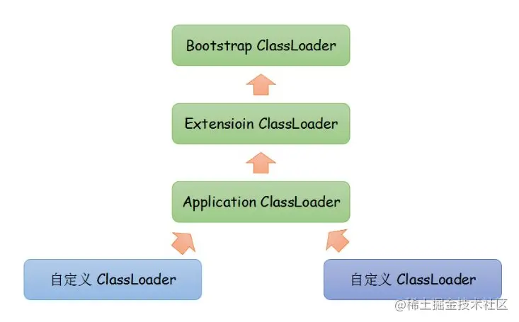
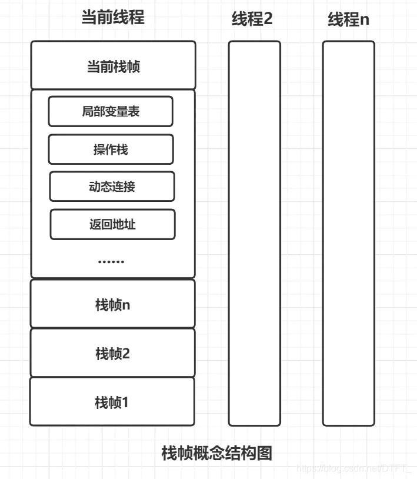
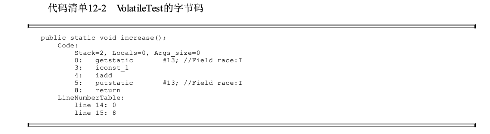

# 一、走近Java

## 1. 走近Java（略读）

# 二、自动内存管理

## 2. Java内存区域与内存溢出异常

1. 概述：Java不像C、C++一样需要手动去管理内存，但是因为如此，如果不了解JVM的内存管理机制，出问题的时候就会比较难定位；

2. 运行时数据区域
   
   1. **程序计数器**：当前线程执行的字节码的行号指示器。
      1. 字节码解释器的工作就是通过改变这个计数器的值来选去下一条需要执行的指令，是程序**<u>控制流</u>**的指示器；
      2. 因为Java是jvm的多线程是勇敢多线程罗欢、分配处理器执行时间实现的，所以在一个时刻，一个处理器只会执行一条线程的指令；为了**<u>切换后能够恢复到正确的位置</u>**；每个线程都有一个独立的程序计数器，各个现场互不影响，独立存储，这类内存称为“**<u>线程私有</u>**”的内存。
      3. 如果正在执行Java方法，则PC中是他正在执行的虚拟机字节码指令的地址；如果是本地（native）方法，则PC为空
      4. 此内存区域是唯一一个**<u>没有OOM</u>**的区域
   2. **Java虚拟机栈**
      1. **<u>线程私有，生命周期和线程相同。</u>**
      2. 每个方法执行的时候，Java虚拟机都会同步创建一个栈帧用于存储局部变量表、操作数栈、动态链接、方法出口等信息。
      3. 人们粗糙的划分Java虚拟机内存为堆栈部分，这里的“栈”指的就是**<u>虚拟机栈，或者是其中的局部变量表部分</u>**；
      4. **局部变量表**存放了编译期可知的**<u>Java虚拟机基本数据类型、对象引用和return Address类型</u>**；
      5. 这些数据类型在局部变量表中以**<u>slot</u>**的来表示，其中double和long（64位）会占据两个槽，其余的1个；
      6. 内存空间在编译期进行分配，当进入一个方法时候，所需的内存空间是确定的，运行期间不会改变；
      7. 这个内存区域存在两类异常：1是因为线程请求的栈深度大雨虚拟机允许的深度，则StackOverFlowError；2是因为虚拟机栈容量动态扩展申请不到足够内存时候引起的OutOfMemoryError。
   3. **本地方法栈**
      1. 与Java虚拟机栈的作用类似，只不过他执行的是虚拟机使用到的本地方法；而虚拟机栈执行的是Java方法（也就是字节码）；
      2. ***本地方法***：简单地讲，**一个Native Method就是一个Java调用非Java代码的接囗**。该方法的实现由非Java语言实现，比如C。
         1. 为什么使用：在开发过程中，有些功能可能是使用C、C++实现的，有时候为了能够**复用这些功能**，就需要使用Native method；还有一点就是**操作系统底层的功能也需要使用本地方法去调用**；另外JVM自己的代码，有一部分使用C实现的，这些代码的使用也需要使用本地方法。
   4. **Java堆**
      1. 是所有线程共享的一块区域，在虚拟机启动时创建。不需要连续内存一般。
      2. **<u>唯一目的就是存放对象实例</u>**。
      3. 是垃圾收集器管理的区域，所以又叫GC堆；
      4. 如果在Java堆中没有完成实例分配并且堆也再无法扩展时，虚拟机会抛出oom。
   5. **方法区**
      1. 线程共享的区域，用来存储已经被虚拟机加载的类型信息、常量、静态变量、即使编译器编译后的代码缓存等数据。
      2. 如果方法区无法满足内存分配需求时，会抛出oom
   6. **运行时常量池**：是方法区的一部分
      1. 常量池表用于存放编译期生成的各种字面量和符号引用，这部分内容会在类加载后放到方法区
   7. **直接内存**
      1. 并非虚拟机运行时数据区一部分，只不过会被经常用到，而且作为内存也存在oom

3. HotSpot虚拟机探秘
   
   1. 对象的创建
      
      1. **<u>类加载检查</u>**。首先去检查常量池中是否存在对应一个类的符号引用，并且是否已经被加载解析和初始化过；
      2. **<u>分配内存</u>**。
         1. 空间的划分分为两种，一种内存是规整的（即使用过的在一边，未使用过的在一边），则只需要一个指针就可以分配，因为内存的分配就是简单的指针的移动，这种叫**<u>指针碰撞</u>**；另一种是空间是交错的，虚拟机需要维护一个表来记录可用不可用的区域，分配的时候就在表中找一块足够大的区域分配，这种叫**<u>空闲列表</u>**。空间规整与否是由GC是否有**空间压缩整理**的的能力决定。
         2. 并发情况下，有两种方法避免线程不安全：
            1. CAS + 失败重试保证原子性；
            2. 在不同的空间中划分，TLAB
      3. **初始化**
         1. 如果使用了TLAB，会提前在这一步分配时进行；
         2. 这个操作保证了Java代码不需要赋初值就可以使用，访问其零值；
      4. **对象头的设置**
   
   2. 对象的内存布局
      
      1. **对象头**：包含自身运行时的数据和类型指针（指向他类型原数据的指针）。
         1. 如果对象是一个数组，对象头还会保存一个记录数组长度的数据；
      2. **实例数据**：对象真正存储的有效信息。
         1. 在HotSpot中，相同宽度的字段会分配到一起存放，父类的定义会出现在子类之前；
      3. 对齐填充，非必需，占位符作用。因为hotspot要起对象的起始地址是8的整数倍。
   
   3. 对象的访问定位
      
      1. Java程序会通过栈上的reference来操纵堆上的具体对象，但是方式由虚拟机决定；
      2. 有两种：
         1. **<u>句柄</u>**：Java堆中划分一块内存作为句柄池，reference中存储的就是对象的句柄地址，而句柄中包含了对象实例数据与数据类型各自具体的地址信息；
         2. **<u>直接</u>指针**：reference中存储的就是对象地址（Java堆中需要考虑如何防访问数据类型的相关信息），如果只是访问对象本身，就不需要一次间接访问的开销，快。HotSpot主要使用这种。
   
   4. 实战：OutOfMemoryError异常
      
      1. Java堆溢出
         
         1. ```java
             import java.util.ArrayList;
             import java.util.List;
               
             /**
              * -verbose:gc -Xms20M -Xmx20M - XX:+HeapDumpOnOutOfMemoryError
              */
               
             public class HeapOOM {
                 static class OOMObject {
                 }
               
                 public static void main(String[] args) {
                     List<OOMObject> list = new ArrayList<OOMObject>();
               
                     while (true) {
                         list.add(new OOMObject());
                     }
                 }
             }
            ```
         
         2. 出现这个区域的异常，常规处理方法是通过内存映像工具对Dump出来的堆转储快照进行分析
            
            1. 确认内存中导致OOM的对象是否是必要的，区分是出现了**<u>内存泄漏</u>**还是<u>**内存溢出**</u>：
               1. 如果是泄漏，则可以通过工具查看GC Root引用链，看他的引用路径、和哪些GC Root关联，导致GC无法回收他们
               2. 如果不是泄漏，即虚拟机中的对象都是必须存活的，那对应的Java虚拟机的参数设置看是否要调整，再从代码上看是否有一些对象生命周期过长，持有时间过长、存储结构设计不合理，减少程序运行期的内存消耗。
      
      2. 虚拟机栈和本地方法栈溢出
         
         1. ```java
             public class JavaVMStackSOF {
                 /**
                  * -Xss128k
                  */
                 private int stackLength = 1;
                 public void stackLeak() {
                     stackLength++;
                     stackLeak();
                 }
               
                 public static void main(String[] args) throws Throwable {
                     JavaVMStackSOF oom = new JavaVMStackSOF();
                     try {
                         oom.stackLeak();
                     } catch (Throwable e) {
                         System.out.println("stack length:" + oom.stackLength);
                         throw e;
                     }
                 }
             }
            ```
            
             结果：
            
            ```
            stack length:16608
            Exception in thread "main" java.lang.StackOverflowError
                at JavaVMStackSOF.stackLeak(JavaVMStackSOF.java:8)
                at JavaVMStackSOF.stackLeak(JavaVMStackSOF.java:8)
                at JavaVMStackSOF.stackLeak(JavaVMStackSOF.java:8)
                ...
            ```
         
         2. 对于不同的虚拟机和操作系统，栈容量最小值会有不同，这主要取决于操作系统内存分页大小。
         
         3. 无论是由于栈帧太大还是虚拟机容量太小，当新的栈内存无法分配，都是栈溢出错误，因为hotspot不允许动态扩展。
         
         4. 一般来说正常的方法调用，虚拟机的默认参数是够用的；但是如果在建立*<u>多线程</u>*出现栈内存溢出的时候，在不能减少内存书看或者更换64位虚拟机，只能是减少最大堆和减少栈容量来获取更多线程。
      
      3. 方法区和运行时常量池溢出
         
         1. JDK7之前，常量池分配在永久代中，JDK7及之后字符串常量池被移到Java堆中；
         2. JDK8之后，元空间替代永久代登场，HotSpot提供了一些参数：
            1. -XX: MaxMetaSize：设置最大值，默认-1即不限制，或者说只受限于本地内存大小
            2. MetaSpaceSize：初始空间大小
            3. MinMetaspaceFreeRation：控制最小元空间剩余容量，减少因为元空间不足导致的垃圾收集频率。
      
      4. 本机直接内存溢出
         
         1. 可通过-XX：MaxDirectMemorySize指定，如果不指定则与Java堆最大值默认一致；
         
         2. ```java
             import sun.misc.Unsafe;
               
             import java.lang.reflect.Field;
               
             /**
              * -Xmx20M -XX:MaxDirectMemorySize=10M
              */
               
             public class DirectMemoryOOM {
                 private static final int _1MB = 1024 * 1024;
               
                 public static void main(String[] args) throws Exception{
                     Field unsafeField = Unsafe.class.getDeclaredFields()[0];
                     unsafeField.setAccessible(true);
                     Unsafe unsafe = (Unsafe) unsafeField.get(null);
                     while (true) {
                         unsafe.allocateMemory(_1MB);
                     }
                 }
             }
            ```
         
         3. 由直接内存导致的栈溢出的明显特征就是HeapDump文件中不会看到明显的异常，如果**发现Dump文件很小，而程序中又使用了直接内存**，可以考虑查看这方面的原因。
      
      5. 小结：本章了解了虚拟机内存的划分以及哪部分区域、什么样的代码会导致内存溢出异常。下一章会讲解GC做了哪些努力来避免内存溢出。

## 3. 垃圾收集器与内存分配策略

1. 概述
   
   1. PC、虚拟机栈、本地方法随着线程而生而灭，每一个栈帧分配多少内存基本上是类结构确定下来时候就是已知的，因此这几个区域的内存分配和回收具备去订下，方法结束或者线程结束时， 内存自然就跟随着回收了；
   2. Java堆和方法区则有着很强的不确定性：一个借口的多个实现类需要的内存可能不一样，一个方法执行的不同分支需要的内存也不一样；

2. 对象已死？->垃圾回收前第一件事就是确认对象是否存活。
   
   1. **引用计数算法**：在对象中添加一个引用计数器，每当一个地方引用他，计数器加一，引用失效时，计数器减一，任何时刻计数器为零的对象就是不可能再被引用。
      
      1. 占用额外内存的空间，但是原理简单，**判定效率高**。
      
      2. Java没有使用因为有很多例外情况需要考虑（例如**<u>循环引用</u>**），需要大量的额外处理；
         
         1. ```java
             public class ReferenceCountingGC {
                 /**
                  * objA  和 objB会不会被GC呢？
                  */
               
                 public Object instance = null;
               
                 private static final int _1MB = 1024 * 1024;
               
                 // 这个成员属性的唯一意义就是占点内存，以便能在GC日志中看清楚是否回收过
                 private byte[] bigSize = new byte[2 * _1MB];
               
                 public static void main(String[] args) {
                     ReferenceCountingGC objA = new ReferenceCountingGC();
                     ReferenceCountingGC objB = new ReferenceCountingGC();
                     objA.instance = objB;
                     objB.instance = objA;
               
                     objA = null;
                     objB = null;
               
                     // 加上在这行发生GC， objA和objB会被回收吗？
                     System.gc();
                 }
               
             }
            ```
            
             结果：虚拟机正常执行GC，并没有因为他们互相引用就放弃回收，侧面说明Java不是使用reference counting算法。
   
   2. **可达性分析算法**：这个算法思路就是通过一系列成为“GC Roots”的根对象作为起始点集，从这些节点开始根据引用关系向下搜索，搜索过长所走过的路程称为“引用链”，如果某个对象到GC roots间没有任何引用链相连（从GC Roots到某个对象不可达），则证明此对象是不可能再被使用的。
      
      1. Java中可作为GC Roots的对象包括
         1. 虚拟机栈中引用的对象，例如正在运行的方法使用到的参数、局部变量、临时变量等；
         2. 方法区中类静态属性引用的对象；
         3. 方法区中常量引用的对象，比如常量池中的引用；
         4. 本地方法栈中JNI（即Native方法）引用的对象；
         5. 虚拟机内部的引用，如基本数据类型对应的Class对象一些常驻的异常等，还有系统类加载；
         6. 所有被同步锁持有的对象
         7. 反映Java虚拟机内部情况的JMXBean，JVMTI中注册的回调、本地代码缓存等。
         8. **<u>局部回收</u>**中堆的其他区域也有可能成为GC Roots
   
   3. 再谈引用
      
      1. 定义：传统定义：如果reference类型的数据中存储的数值代表的是另一块内存的起始地址，就成该reference数据是代表某块内存、某个对象的引用。
         1. 强引用：传统的引用。
         2. 软引用：**有用但非必需**。在系统<u>将要发生内存溢出异常前</u>，才会把这些对象列进回收范围之中进行第二次回收。
         3. 弱引用：只能生存到下一次垃圾回收。
         4. 虚引用：一个对象是否有虚引用存在不会对其生存时间产生影响，也无法通过虚引用获得一个实例。他**<u>唯一的目的就是能在这个对象被回收的时候收到一个系统通知</u>**。
   
   4. 生存还是死亡？
      
      1. 即使是被判定为不可达，也不一定被GC。真正宣告一个对象死亡要经历两个标记过程；
         1. 可达性分析**<u>发现不可达</u>**之后标记一次；
         2. 再筛选对象是否需要执行**<u>```finalize()```</u>**方法。假如对象没有覆盖```finalize()```方法，或者这个方法已经被虚拟机调用过，虚拟机将这两种情况视为没必要执行。需要被执行的放入F-Queue中会被标记。
      2. 当他被判定需要执行```finalize()```方法，则该对象会被放入一个<u>**F-Queue**</u> 的队列，并在稍后会由一条虚拟机自动建立的、低调度优先级的Finalizer线程去执行他们的```finalize()```方法。
         1. 虚拟机会触发这个方法但不会等待他执行完毕，因为某个对象的finalize()方法执行缓慢会导致整个队列处于等待，甚至是整个回收子系统的崩溃。
         2. 对象如果在队列中被引用链中的对象关联即可逃脱被回收；
         3. 一个对象的finalize方法最多执行一次；
   
   5. 回收方法区
      
      1. 方法区回收条件苛刻，“性价比低”；
      2. 回收内容：废弃的常量和不再使用的类型。
      3. 废弃常量：
         1. 例如一个常量池中字面量回收。没有一个字符串对象引用，虚拟机中也没有方法引用，如果发生GC且垃圾收集器，这个字符串常量会被清理出常量池。
         2. 类型。
            1. 该类的实例都被回收
            2. 加载该类的类加载器被回收。
            3. 该类对应的java.lang.Class对象没有在任何地方被引用。
      4. 大量使用动态代理、反射、GCLib等字节码框架等**<u>频繁自定义类加载</u>**的场景中，都需要Java虚拟机具备**<u>类型卸载</u>**的能力来保证方法区没有过大的内存压力。

3. 垃圾收集算法
   
   1. 分代收集理论
      
      1. 建立在两个假说之上的经验法则：
         
         1. **弱分代假说：绝大多数对象都是朝生夕灭的；**
         2. **强分代假说：熬过越多次垃圾收集过程的对象就越难消亡；**
      
      2. 这两个分代假说奠定了**多款常用的GC的设计原则**：<u>收集器应该将java堆划分出不同的区域，然后将回收对象根据其年龄（熬过垃圾回收的次数）分配到不同的区域中存储</u>。
      
      3. 现代商用JVM至少分为：**<u>新生代</u>**和**<u>老年代</u>**。在新生代中，每次垃圾收集都会有大批对象死去，而每次回收后存活的少量对象将会逐步晋升到老年代中存放。
      
      4. <u>**Minor CG**</u>：只限于**新生代**中的收集。这个时候会有一些新生代被老年代引用，而了找出这些对象又需要在所有的老年代里面去遍历，这样会存在性能负担。
      
      5. 为了解决这个问题，又引入一个假说：**跨代引用假说**
         
         1. **跨代引用相对于同代引用来说仅占少数。**
         2. 新生代会建立一个全局数据结构：**记忆集**，把老年代分为若干小块，当Minor GC发生时。只有包含了跨代引用的小块内存会被加入到GC Roots进行扫描。
      
      6. **<u>部分收集</u>** <u>**Partial GC**</u>： 指目标不是完整手机整个Java堆的垃圾收集，其中又分为
         
         1. **<u>新生代收集（Minor GC/Young GC）</u>**：只限于**新生代**中的收集
         2. **<u>老年代收集（Major GC/Old GC）</u>**： 指目标只是老年代的垃圾收集。（只有CMS收集器会有单独手机老年代的行为）。
         3. 混合收集：指目标是收集整个新生代以及部分老年代的垃圾收集。（只有G1收集器会有这个行为）。
      
      7. **<u>整堆收集（Full GC）</u>**：收集整个Java堆和方法区的垃圾收集。
   
   2. **<u>标记-清除算法</u>**：首先标记出需要回收的对象，在标记完成后统一回收掉标记的对象；或者标记存活的对象，统一回收未被标记的对象。标记的过程就是是否是垃圾的判定过程。
      
      1. 缺点：1. 执行效率不稳定：如果Java堆存在大量的对象而且其中大量需要被回收，则会有大量的标记和清除动作，降低算法的执行效率；2. 内存空间的碎片化问题，导致后续较大对象存入找不到足够连续内存而再进行GC的动作。
   
   3. **<u>标记-复制算法</u>**：解决标记清除算法执行效率低的问题。具体内容是：按照可用内存容量分为大小相当的两块，每次只使用其中一块，这一块用完了就把还存活着的复制到另一块上去，再把已使用过的内存空间一次清理掉。
      
      1. 对于对数情况都是可回收到，这个算法只需要复制少量对象即可；运行高效；但是代价就是可用的内存缩小为原来一半。
      2. 更优化的**<u>“Apple”式回收</u>**：将内存分为Eden和两个Survivor，每次只使用eden和一个Survivor，垃圾收集时，将他们的内容复制到另一个Survivor上，清理掉已使用的Eden和Survivor上的内容；Eden和Survivor这两个区域的比例一般是8:1，即新生代中可用空间为90%总容量。
      3. 当存活对象超过10%，就需要依赖其他区域进行**分配担保**。->直接进入老年代。
   
   4. **<u>标记-整理算法</u>**：如果在老年代这种区域，大部分对象都会存活，标记复制就会效率低下。所以有了标记整理：标记过程和标记清除算法的前半部分一样，之后让所有存活对象向内存空间的一端移动，然后直接清理掉边界以外的内存。
      
      1. **移动式的回收算法**：风险1. 移动所有存活对象必须暂停整个程序；2. 如果不移动又有很多碎片可能，然后又要引入更复杂的机制来处理（内存分配器、内存处理器），增加额外的负担。
      2. 整体吞吐量（赋值器和收集器效率总和）来看，移动对象更划算。
   
   5. 还有一种和稀泥式的，多数时间是标记清除，碎片很影响对象分配了，标记整理一次。

4. HotSpot的算法细节实现（Skip）

5. 经典垃圾收集器（Skip）

6. 低延迟垃圾收集器（Skip）

7. 选择合适的垃圾收集器（Skip）

8. 实战：内存分配与回收策略
   
   1. 多数情况下，**<u>对象优先在Eden区分配</u>**，当Eden没有足够空间，JVM将进行一次Minor GC。
   2. **<u>大对象直接进入老年代</u>**。
   3. **<u>长期存活的对象将进入老年代。</u>**
   4. 动态对象年龄判定：如果年龄低于或等于某个年龄的对象总和大于Survivor容量的一半，则年龄大于或等于该年龄的对象直接进入老年区。
   5. 空间分配担保。在发生minor GC之前先看是否允许老年代空间担保失败，如果允许则看一下之前回收晋升到老年代的容量的平均值和老年代剩余容量对比，如果老年代不够存了，或者之前不允许担保失败，则进行Full GC。

9. 本章小结
   
   1. 介绍了**<u>垃圾收集算法</u>**，若干HotSpot中垃圾收集器，实例代码验证了Java虚拟机中**<u>自动内存分配和回收的主要规则</u>**。

## 4. 虚拟机性能监控、故障处理工具（Skip）

## 5. 调优案例分析与实战（Skip）

# 三、虚拟机执行子系统

## 6. 类文件结构

1. 概述
2. 无关性的基石：**<u>虚拟机和字节码存储格式。</u>**
3. Class类文件的结构
   1. Class文件是一组以字节为基础单位的二进制流，更数据项目严格按照顺序紧凑地排列在文件之中，中间没有添加任何分隔符。当遇到需要占用单个字节以上的空间的数据项时，则会按照高位在前（[Big Endian](https://zh.wikipedia.org/wiki/%E5%AD%97%E8%8A%82%E5%BA%8F)）的方式分割成若干个字节进行存储。
   2. Class文件格式：**<u>无符号数</u>**（基本数据类型）和**<u>表</u>**（多个无符号数活着其他表作为数据项构成）。
   3. 魔数与Class文件的版本
      1. 魔数：每个class的前四个字节。确定这个文件是否为能被虚拟机接受的Class文件。值为：0XCAFEBABE。
      2. 紧接着魔数的四个字节是Class文件的版本号。第5、6是次版本号，7、8是主版本号。
   4. 常量池：在入口要放置一个u2类型的数值标明常量的数量（从1开始）
      1. 字面量：文本字符串、声明为final的常量值；
      2. 符号引用：
         1. 被模块导出或者开放的包；
         2. 类和接口的全限定名；
         3. 字段名称和描述符
         4. 方法名称和描述符
         5. 方法句柄和方法类型
         6. 动态调用点和动态常量
   5. 访问标志：紧接着的两个字节，用于识别一些类或者接口层次的访问信息，包括这个class是类还是接口，是否定义为public；是否定义abstract，如果是类是否定义为final等。
   6. 类索引，父类索引和接口索引集合
   7. 字段表集合：用于描述接口或者类中声明的变量。
      1. 包含类级变量以及实例级变量，但不包含方法内的局部变量。
      2. 字段的作用域（public 、private、protected）
      3. 实例变量还是类变量（static）
      4. 可变性（final）
      5. 并发可见性（violate）
      6. 可否被序列化（transient）
      7. 字段数据类型（基本类型、对象、数组）
      8. 字段名称-》引用常量池的常量
   8. 方法表集合
   9. 属性表集合
      1. Code
      2. Exceptions
      3. LineumberTbale
      4. LocalVirableTable 和LocalVariableTypeTable
      5. SourceFile和SourceDebugExtension
      6. ConstantValue
      7. InnerClasses
      8. Deprecated 及Synthetic 
      9. StackmapTable
      10. Signature
      11. BootstrapMethods
      12. MethodParameters
      13. 模块化相关属性
      14. 运行时注解相关属性
   10. 字节码指令简介
   11. 公有设计，私有实现
   12. class文件结构的发展
   13. 本章小结
       1. class文件结构中的各个组成部分，以及每个部分的定义、数据结构和使用方法

## 7. 虚拟机类加载机制

1. 概述：虚拟机如何加载这些Class文件，文件中的信息进入到虚拟机之后的变化
   
   1. JVM把描述累的数据从Class文件加载到内存，并对数据进行校验、转换解析和初始化，最终形成可以被虚拟机直接使用的Java类型，称为虚拟机的类加载机制。

2. 类加载的时机
   
   1. 生命周期：**<u>加载、验证、准备、解析、初始化、使用、卸载</u>**
   
   2. 解析有可能在初始化之后再开始，为了支持**<u>运行时绑定</u>**（动态绑定）的特性
   
   3. 什么时候开始“**<u>加载</u>**”并没有约束，但是**有且只有六种情况**必须立即**<u>“初始化”</u>**，（加载验证准备自然要在他之前开始）：
      
      1. 遇到new,getstatic, putstatic, invokestatic这四条字节码指令，如果类型没有进行过初始化，则需要先触发其初始化阶段，能够生成这四个指令的典型场景有：
         1. 使用new关键字实例化对象的时候；
         2. 读取或者设置一个类型的静态字段（被final修饰、已在编译器把结果放入常量池的静态字段除外）的时候；
         3. 调用一个类型的静态方法的时候；
      2. 使用java.lang.reflect包的方法对类型进行反射调用的时候，如果类型没有进行过初始化，则需要先触发其初始化；
      3. 当初始化类的时候，其父类还没有进行初始化，则需要先触发其父类的初始化；
      4. 当虚拟机启动时，用户需要制定一个执行的主类（包含```main()```方法的那个类），虚拟机会先初始化这个主类；
      5. 当使用JDK7新加入的动态语言支持时候，如果一个java.lang.invoke.MethodHandle实例最后的解析结果为REF_getStatic,REF_putStatic, REF_invokeStatic,REF_newInvokeSpecial四种类型方法句柄，并且这个方法句柄对应的类没有进行过初始化，则需要先触发其初始化；
      6. 当一个接口中定义了JDK8新加入的默认方法（default修饰的接口方法）时，如果这个接口的实现类发生了初始化，那该接口要在其之前被初始化。
   
   4. 以上六种行为称为对一个类型进行**主动引用**， 除此之外，所有的引用类型的方式都不会触发初始化，称为**被动引用。**
      
      1. ```java
          /**
           * 被动使用类字段演示一：
           * 通过子类引用父类的静态字段，不会导致子类初始化
           */
            
          public class SuperClass {
              static {
                System.out.println("Superclass init");
              }
            
              public static int value = 123;
          }
            
          public class SubClass extends SuperClass{
              static {
                System.out.println("Subclass init");
              }
          }
            
          public class NotInitialization {
              public static void main(String[] args) {
                  System.out.println(SubClass.value);
              }
          }
         ```
      
      2. 上述代码运行后除了value之外，只会输出"Superclass init"，因为对于静态字段，只有直接定义这个字段的类才会被初始化，因此只有通过子类引用父类的静态字段，只会触发父类的初始化而不会触发子类的初始化。
      
      3. ```java
          /**
           * 被动使用类字段演示二：
           * 通过数组定义引用类，不会导致子类初始化
           */
          public class SuperClass {
              static {
                  System.out.println("Superclass init");
              }
            
              public static int value = 123;
          }
            
          public class NotInitialization {
              public static void main(String[] args) {
                  SuperClass[] sca = new SuperClass[10];
              }
          }
         ```
      
      4. ```java
          /**
           * 被动使用类字段演示三；
           * 常量在编译阶段会存入调用类的常量池中，本质上没有直接引用到定义常量的类，因此不会触发定义常量的类的初始化
           */
          public class ConstClass {
              static {
                  System.out.println("Constclass init!");
              }
            
              public static final String HELLOWORLD = "hello world";
          }
            
          public class NotInitialization {
              public static void main(String[] args) {
                  System.out.println(ConstClass.HELLOWORLD);
              }
          }
         ```
      
      5. 上面的代码运行后也没有输出"Constclass init!"。在编译阶段通过常量传播优化，将“hello world”直接存在NotInitialization的常量池了。以后NotInitialization对ConstClass.HELLOWORLD的引用都转化为NotInitialization自身常量池的引用了。
      
      6. 接口的加载过程与类的加载过程稍有不同
         
         1. 接口也有初始化过程，这一点与类一致；
         2. 真正有区别的是上述六种有且仅有情况的第三点：当初始化类的时候，需要先触发其父类的初始化；**<u>接口则不需要其父接口都完成初始化</u>**，只有当真正使用到父接口（如引用接口中定义的常量）才会初始化。

3. **类加载的过程**
   
   1. **<u>加载</u>**
      
      1. 做三件事：
         1. 通过一个类的全限定名来获取定义此类的二进制字节流；
         2. 将这个字节流代表的静态存储结构转化为方法区的运行时数据结构；
         3. 在内存中生成一个代表这个类的java.lang.Class对象，作为方法区的这个类的各种数据访问入口；
      2. 对于数组类来说，他不通过类加载器创建，它是由JVM直接在内存动态构造；
         1. 如果数组的组件类型是引用类型，那就递归采用上面的加载过程加载这个组件类型，数组将被标识在加载该组件类型的类加载器的类名称空间上；
         2. 如果数组的组件类型不是引用类型，JVM将会把该数组标记为与启动类加载器关联；
         3. 数组类的可访问性与他的组件的可访问性一致，如果组件类型不是引用类型，他的数组类的可访问性默认是public。
      3. 加载阶段结束后，二进制字节流就按照虚拟机设定的格式存储在内存方法区了；
      4. 加载阶段与连接（验证、解析、初始化）阶段的部分动作交叉进行；
   
   2. **<u>验证</u>**：确保Class文件的字节流中包含的信息符合《Java虚拟机规范》的全部要求。
      
      1. 文件格式验证。字节流符合格式规范。
      2. 元数据验证。字节码描述的信息进行语义分析，确保符合要求。
      3. 字节码验证，确保程序语义是合法的、符合逻辑的。
         1. 由于很复杂，JDK6之后给方法体Code属性表中引入“StackMaptable”属性，它描述了方法所有基本块开始时本地变量和操作栈应有的状态。节省了时间。
      4. 符号引用验证。
         1. 发生在JVM将符号引用转化为直接引用时，这个发生在“解析”阶段。**确保解析行为能正常执行**。
         2. 检验这个类是否缺少或者被禁止访问他依赖的外表类、方法、字段等资源。
   
   3. **<u>准备</u>**：正式为类中定义的变量分配内存并设置变量初始值的阶段。
      
      1. **这时候进行内存分配的是类变量，不包括实例变量**。实例变量会在对象实例化时随着对象一起分配在Java堆中。
         1. ```public static int value = 123;``` 在准备阶段过后value的值是0而不是123；
         2. 特殊情况：如果类字段的字段属性表中存在ConstantValue属性，在准备阶段变量值接会被初始化。```public static final int value = 123;``` 准备阶段虚拟机就会给value赋值123了。
   
   4. **<u>解析</u>**：JVM将常量池内的符号引用替换为直接引用的过程。
      
      1. **符号引用**： 以一组符号描述所引用的目标，可以是任意符号，只要是无歧义的定位到目标即可。
      2. **直接引用**：可以直接指向目标的指针、相对偏移量或者是一个能间接定位到目标的句柄。
      3. 主要针对类、接口、字段、类方法、接口方法、方法类型、方法句柄和调用点限定符这7类符号引用进行。
         1. 类或接口的解析
         2. 字段解析
         3. 方法解析
   
   5. **<u>初始化</u>**：根据程序编码制定的计划去初始化变量。**<u>初始化阶段就是执行类构造器```<clinit>()```方法的过程。</u>**
      
      1. ```<clinit>()```编译器自动收集类中所有的类变量的赋值动作和静态语句的块中的语句合并产生。收集顺序是语句在原文件中出现的顺序。
         
         1. 静态语句块中只能访问定义在其之前的变量，定义在其之后的变量，可以在这个静态语句块中赋值，但不可以访问。如下代码：
         
         2. ```java
             public class TestClass {
               
                 static {
                     i = 0; // 给变量赋值可以正常编译通过
                     System.out.print(i); // 这句话编译器会提示"非法向前引用"
                 }
                 static int i = 1;
             }
            ```
      
      2. ```<clinit>()``` 方法与类的构造函数不同，他不需要显式的调用父类构造器，JVM会保证子类的```<clinit>()``` 执行前，父类的```<clinit>()``` 已经执行完毕。因此在JVM中第一个被执行的```<clinit>()``` 类型肯定是java.lang.Object
      
      3. 由于父类的```<clinit>()``` 先执行，也意味着父类中定义的静态语句块要有优先于子类的变量赋值操作，如下代码，B的值是2不是1:
         
         1. ```java
             public class Parent {
                 public static int A = 1;
                 static {
                     A = 2;
                 }
             }
            ```

                static class Sub extends Parent {
                    public static int B = A;
                }
                 
                public static void main(String[] args) {
                    System.out.println(Sub.B);
                }
                ```
   
        4. ```<clinit>()``` 不是必须的，没有静态语句块，没有赋值操作，就不需要。
   
        5. 接口不能使用静态语句块，但仍然有变量初始化赋值操作，所以接口也会有```<clinit>()``` 方法。但是接口的实现类在初始化时不会执行```<clinit>()``` ，只有用到了才会。
   
        6. JVM需要保证一个类的```<clinit>()``` 方法在多线程环境被正确的加锁同步。

4. 类加载器：“通过一个类的全限定名来获取描述该类的二进制字节流”实现这个动作的代码称为“**<u>类加载器</u>**”。
   
   1. 类与类加载器
      
      1. 每个类都是由**<u>它本身</u>**和**<u>加载它的类加载器</u>**共同确立唯一性。
      
      2. ```java
          import java.io.IOException;
          import java.io.InputStream;
            
          /**
           * 类加载器与instanceof关键字演示
           */
            
          public class ClassLoaderTest {
              public static void main(String[] args) throws Exception {
                  ClassLoader myLoader = new ClassLoader() {
                      @Override
                      public Class<?> loadClass(String name) throws ClassNotFoundException {
                          try {
                              String filename = name.substring(name.lastIndexOf(".") + 1) + ".class";
                              InputStream is = getClass().getResourceAsStream(filename);
                              if (is == null) {
                                  return super.loadClass(name);
                              }
                              byte[] b = new byte[is.available()];
                              is.read(b);
                              return  defineClass(name, b, 0, b.length);
                          } catch (IOException e) {
                              throw new ClassNotFoundException(name);
                          }
                      }
                  };
            
                  Object obj = myLoader.loadClass("ClassLoaderTest").newInstance();
            
                  System.out.println(obj.getClass());
                  System.out.println(obj instanceof ClassLoaderTest);
              }
          }
         ```
      
      3. 运行结果：
         
         1. class ClassLoaderTest
             false
         2. 第二个返回false的原因是因为ClassLoaderTest类一个是由JVM的应用程序类加载器加载的，另外一个是由我们自定义的类加载器加载的，是**<u>两个独立的类</u>**。
   
   2. 双亲委派模型
      
      1. (HotSpot)从虚拟机的角度看，只存在两种类加载器：
         
         1. **<u>启动类加载器</u>**（Bootstrap ClassLoader）：它使用C++实现，是虚拟机的一部分;
         2. 其他所有类的加载器，由Java实现，独立存在于JVM之外，继承自java.lang.ClassLoader
      
      2. 启动类加载器：
         
         1. 负责加载存放在<JAVA_HOME>\lib目录或者被-vootclasspath指定的路径存放的，且能够被JVM识别的类库加载到虚拟机内存
         
         2. 无法被Java程序直接引用
            
            1. ```java
                /**
                 * 返回类的类加载器。有些执行会使用null替代启动类加载器，即当这个类是启动类加载器加载的时候这个方法会返回null
                 */
                public ClassLoader getClassLoader() {
                    ClassLoader cl = getClassLoader0();
                    if (cl == null) {
                        return null;
                    }
                    SecurityManager sm = System.getSecurityManager();
                    if (sm != null) {
                        ClassLoader ccl = ClassLoader.getCallerClassLoader();
                        if (ccl != null && ccl != cl && cl.isAncestor(ccl)) {
                          sm.checkPermission(SecurityConstants.GET_CLASSLOADER_PERMISSION);
                        }
                    }
                    return cl;
                }
               ```
      
      3. 扩展类加载器：Java代码实现，负责加载<JAVA_HOME>\lib\ext或者是被java.ext.dirs系统变量制定的路径中的所有类库
      
      4. 应用类加载器（系统类加载器）
      
      5. **<u>双亲委派模型</u>**要求除了顶层的启动类加载器，其余的加载器都需要有自己的父类加载器，这个夫子关系不是继承，而是组合。
         
         1. 
         
         2. **<u>工作过程</u>**：如果一个类加载器收到了类加载的请求，他首先不会自己去尝试加载这个类，而是把这个**<u>请求委派给父类加载器去完成</u>**，每一个层次的类加载器都是如此，因此所有的加载请求最终都应该传送到最顶层的类启动加载器，只有当父加载器反馈自己无法完成这个加载请求（他的搜索范围没找到所需的类）时，子加载器才会自己去尝试完成加载。
         
         3. 好处：**类随着类加载器有了带优先级的层级关系**，例如java.lang.Object存放在rt.jar，Object在所有类加载器环境都保证是同一个类
         
         4. 实现：
            
            1. ```java
                protected Class<?> loadClass(String name, boolean resolve)
                        throws ClassNotFoundException
                    {
                        synchronized (getClassLoadingLock(name)) {
                            // First, check if the class has already been loaded
                            Class<?> c = findLoadedClass(name);
                            if (c == null) {
                                try {
                                    if (parent != null) {
                                        c = parent.loadClass(name, false);
                                    } else {
                                        c = findBootstrapClassOrNull(name);
                                    }
                                } catch (ClassNotFoundException e) {
                                    // ClassNotFoundException thrown if class not found
                                    // from the non-null parent class loader
                                }
                  
                                if (c == null) {
                                    // If still not found, then invoke findClass in order
                                    // to find the class.
                                    c = findClass(name);
                                }
                            }
                            if (resolve) {
                                resolveClass(c);
                            }
                            return c;
                        }
                    }
               ```
   
   3. 破坏双亲委派模型（略读）

5. Java模块化系统（略读）

6. 本章小结
   
   1. **类加载的过程：加载、验证、准备、解析、初始化**都执行了哪些动作
   2. 还介绍了**类加载器的工作原理以及对虚拟机的意义**

## 8. 虚拟机字节码执行引擎

1. 概述：从概念模型的角度讲解虚拟机的方法调用和字节码的执行。

2. 运行时栈帧
   
   1. JVM以**<u>方法</u>**作为**最基本的执行单元**；**栈帧**是用于支持JVM进行方法调用和执行的**<u>数据结构</u>**；存储了局部变量表、操作数栈、动态连接、方法返回地址等信息。
   2. 在**<u>编译的时候</u>**栈帧需要的内存大小就被分析计算，并且写入到方法表的code属性中
   3. 一个线程中只有位于栈顶的栈帧才是生效的，被称为**<u>“当前栈帧”</u>**，与这个栈帧关联的方法被称为“**<u>当前方法</u>**”，
      1. 
   4. 局部变量表：是一组变量值的存储空间，用于存放方法参数和方法内不定义的局部变量。在程序被编译为Class文件的时候，就在方法的Code属性的max_local数据项中确定了该方法所需分配的局部变量表的最大容量。
      1. Slot为最小单位；可以使用32位或者更小的内存来存储，对于长度超过32位的，可以以高位对齐的方式存到两个slot；
      2. JVM通过**<u>索引定位</u>**的方法使用局部变量表。
      3. 当方法被调用时候，JVM会使用局部变量表来完成参数值到参数变量列表的传递过程，即实参到形参的传递
      4. 为了节省空间，**slot可以重用**，但是有时候会影响GC
      5. **<u>局部变量没有“准备”阶段</u>**，不赋值就没有初值。
   5. 操作数栈->LIFO栈：用局部变量表一样，在程序被编译为Class文件的时候，就在方法的Code属性的max_local数据项中确定了该方法所需分配的最大容量。
      1. 在方法执行过程中，各种字节码指令往操作数栈中写入和提取内容（**<u>入栈出栈</u>**）；
      2. 元素数据类型和字节码指令的序列严格匹配，eg：iadd只能用于整数类型假发；
      3. 大多数虚拟机会对栈帧进行优化，会有一些**<u>栈帧重叠</u>**，**节省空间，数据共享**（减少数据复制传递）；
   6. 动态连接：每个栈帧都包含一个指向运行时常量池该栈帧所属方法的引用，持有这个引用是为了支持方法调用过程中的动态连接。
      1. 字节码中的**<u>方法的调用</u>**指令就以常量池里只想方法的符号作为参数，这些符号引用一部分在类加载阶段或者第一次使用的时候被转化为直接引用，这种叫**静态解析**，另一部分在每一次运行期间都转化为直接引用，这部分就称为**<u>动态链接</u>**
   7. 方法返回地址
      1. **<u>正常调用完成</u>**：执行引擎遇到任意一个方法返回的字节码指令，可能会有返回值传递给上层的方法调用者；<u>是否有返回值以及返回值的类型取决于遇到何种方法返回指令</u>；
      2. **<u>异常调用完成</u>**：在本方法的异常表**没有搜到匹配的异常处理器**，<u>不会有任何返回值给上层调用</u>。
      3. 方法退出的过程，可能有这些：恢复上层方法的局部变量表和操作数栈，如果有返回值没把返回值压入调用者栈帧的操作数栈，调整PC执行后面的一条指令。。。
   8. 附加信息：调试、性能收集相关的信息。

3. 方法调用：确定**<u>被调用的方法的版本</u>**（调用哪一个方法），**不涉及方法内部运行**。
   
   1. **解析**（静态过程）
      
      1. 所有方法调用的目标方法在Class文件里面都是一个常量池中的符号引用，在类加载的解析阶段，会将其中一部分符号引用转化为直接引用，前提是：**<u>方法在程序运行前有一个可确定的调用版本，且在运行期不可变。这类方法的调用称为“解析”</u>**
      2. 主要有**<u>静态方法</u>**和**<u>私有方法</u>**，前者与类型直接关联，后者在外部不可被访问，这两种方法各自的特点决定了他们不可能通过集成活着重写出其他版本，因此适合在类加载阶段进行解析。
      3. **<u>非虚方法</u>**：静态方法、私有方法、实例构造器、父类方法、再加上final修饰的方法。
   
   2. **分派**（**<u>多态</u>**特征虚拟机如何确定目标方法）
      
      1. 静态分派
         
         1. ```java
             public class StaticDispatch {
               
                 static abstract class Human {
                 }
               
                 static class Man extends Human {
                 }
               
                 static class Woman extends Human {
                 }
               
                 public void sayHello(Human guy) {
                     System.out.println("hello, guy!");
                 }
               
                 public void sayHello(Man guy) {
                     System.out.println("hello, gentleman!");
                 }
               
                 public void sayHello(Woman guy) {
                     System.out.println("hello, lady!");
                 }
               
                 public static void main(String[] args) {
                     Human man = new Man();
                     Human woman = new Woman();
                     StaticDispatch sr = new StaticDispatch();
                     sr.sayHello(man);
                     sr.sayHello(woman);
                 }
             }
            ```
            
             运行结果：
            
            ```
            hello, guy!
            hello, guy!
            ```
         
         2. 静态类型（外观类型）：Human，静态类型的变化仅仅在使用时发生，变量本身的静态类型不变，且最终的静态类型在编译期可知；
         
         3. 实际类型（运行时类型）：Man，实际类型的变化结果在运行期才确定，编译器在编译的时候并不知道对象的实际类型是什么。
         
         4. 上面代码中，编译器在**<u>重载</u>**时是通过参数的静态类型作为判定依据的，所以在编译期选择了```sayHello(Human guy)```作为调用目标。
         
         5. 静态分配多数时候只能分配一个**<u>更合适的</u>**。->重载匹配优先级。
      
      2. 动态分派
         
         1. <u>**重写**</u>：
            
            1. ```java
                public class DynamicDispatch {
                  
                    static abstract class Human {
                        protected abstract void sayHello();
                    }
                  
                    static class Man extends Human {
                        @Override
                        protected void sayHello() {
                            System.out.println("man say hello");
                        }
                    }
                  
                    static class Woman extends Human {
                        @Override
                        protected void sayHello() {
                            System.out.println("woman say hello");
                        }
                    }
                  
                    public static void main(String[] args) {
                        Human man = new Man();
                        Human woman = new Woman();
                        man.sayHello();
                        woman.sayHello();
                        man = new Woman();
                        man.sayHello();
                    }
                }
               ```
               
                输出结果:
               
               ```
               man say hello
               woman say hello
               woman say hello
               ```
            
            2. invokevirtual指令制定的第一步就是在运行期确定接受者的实际类型，所以在两次调用中的invokevirtual指令并不是把常量池中方法的符号引用解析到直接引用上就结束了，还会根据方法接受着的实际类型选择方法版本，这就是**<u>重写</u>**的本质
            
            3. 字段不参与多态
               
               1. ```java
                   public class FieldHasNoPolymorphic {
                     
                       static class Father {
                           public int money = 1;
                     
                           public Father() {
                               money = 2;
                               showMeTheMoney();
                           }
                     
                           public void showMeTheMoney() {
                               System.out.println("I am Father, i have $" + money);
                           }
                       }
                     
                       static class Son extends Father {
                           public int money = 3;
                     
                           public Son() {
                               money = 4;
                               showMeTheMoney();
                           }
                     
                           public void showMeTheMoney() {
                               System.out.println("I am Son, i have $" + money);
                           }
                       }
                     
                       public static void main(String[] args) {
                           Father guy = new Son();
                           System.out.println("This guy has $" + guy.money);
                       }
                   }
                  ```
                  
                   运行结果：
                  
                  ```
                  I am Son, i have $0
                  I am Son, i have $4
                  This guy has $2
                  ```
                  
                   结果分析：
                  
                  > 输出两句都是“I am Son”，这是因为Son类创建的时候，首先隐式调用的Father的构造函数，而Father构造函数中对showMeTheMoney()的调用是一次虚方法的调用，实际执行的版本是Son::showMeTheMoney()方法，所以输出是“I am Son”；而这时候虽然父类的money已经被初始化成2了，但是Son::showMeTheMoney()方法中访问的却是子类的money字段，这时候结果还是0，因为他要到子类的构造函数执行的时候才会被初始化，main（）最后一句通过静态类型访问到了父类中的money，输出了2。
      
      3. 单分派与多分派
         
         1. 方法的接受者和方法的参数统称为方法的宗量。根据**<u>分派基于多少宗量</u>**可以划分为多分派和单分派。
         
         2. ```java
             public class Dispatch {
               
                 static class QQ {
                 }
               
                 static class _360 {
                 }
               
                 public static class Father {
                     public void hardChoice(QQ arg) {
                         System.out.println("father choose qq");
                     }
               
                     public void hardChoice(_360 arg) {
                         System.out.println("father choose 360");
                     }
                 }
               
                 public static class Son extends Father {
                     public void hardChoice(QQ arg) {
                         System.out.println("son choose qq");
                     }
               
                     public void hardChoice(_360 arg) {
                         System.out.println("son choose 360");
                     }
                 }
               
                 public static void main(String[] args) {
                     Father father = new Father();
                     Father son = new Son();
                     father.hardChoice(new _360());
                     son.hardChoice(new QQ());
                 }
             }
            ```
            
             运行结果
            
            ```
            father choose 360
            son choose qq
            ```
         
         3. 编译阶段，编译器的选择过程，静态分派的过程。选择目标方法的依据是静态类型是Father还是Son，二是方法参数是QQ还是360，这次选择的产物产生了两个invokevirtual的指令，两个指令的参数分别为常量池中指向Father::hardChoice(360)和Father::hardChoice(QQ)方法的符号引用；根据两个宗量，属于多分派。
         
         4. 运行阶段虚拟机的选择，动态分派的过程。执行son.hardChoice(new QQ())，由于编译期已经决定目标放大的签名必须是hardChoice(QQ)，唯一可以影响虚拟机选择的因素只有该方法的接受者的实际类型是Father还是Son。只有一个宗量作为选择依据，属于单分派。
      
      4. 虚拟机动态分派的实现
         
         1. 多数会在方法区建立一个**<u>虚方法表</u>**来提高性能。
         2. 一些其他的继承关系分析、守护内联等。。。

4. 动态类型语言支持（Skip）
   
   1. 动态类型语言
   2. Java与动态类型
   3. java.lang.invoke包
   4. invokedynamic指令
   5. 实战：掌握方法分派规则

5. 基于栈的字节码执行解释引擎（Skip）

6. 小结
   
   1. 分析了虚拟机在执行时，**如何找到正确的方法**，**如何执行方法内的字节码**，以及执行代码是涉及的**内存结构。**

## 9. 类加载于执行子系统的案例与实战（Skip）

# 四、程序编译与代码优化

## 10. 前端编译与优化（Skip）

## 11. 后端编译与优化（Skip）

# 五、高效并发

## 12. Java内存模型与线程

1. 概述

2. 硬件的效率与一致性
   
   1. 多个缓存存在时需要遵循一些缓存一致性协议；

3. Java内存模型
   
   1. Java虚拟机规范中试图定义一个Java内存模型，来屏蔽**硬件**和**操作系统**的内**<u>存访问差异</u>**，已实现Java程序在各种平台都可以达到一致的内存访问效果。
   
   2. 主内存与工作内存
      
      1. Java内存模型主要是**<u>定义程序中各种变量的访问规则</u>**，即关注在虚拟机中把变量值存储到内存和从内存中取出变量值这样的底层细节。
         1. 此处的**变量**和Java编程的变量概念有所区别，指的是实例字段，静态字段，和构成数组对象的元素，不包括局部变量和方法参数，因为后者是线程私有，不共享的。
      2. Java内存模型规定所有的变量存储在**<u>主内存</u>**（可以和硬件驻内存类比）。每条线程还有自己的工作内存（和处理器高速缓存类比），现成的工作内存中保存了该线程使用的变量的主内存副本，线程对变量的所有操作必须在工作内存进行，不能直接读取主内存。不同的线程也不能访问对方工作内存的变量。<u>线程间变量值的传递均需要通过主内存来完成</u>。
         1. 
      3. 这里的工作内存、主内存和Java内存区域的堆栈不是一回事。
   
   3. 内存间交互操作：Java虚拟机保证这8个操作是原子的。
      
      1. lock：锁定，作用于主内存的变量，他把一个变量标示为一条线程独占的状态。
      2. unlock：解锁，作用于主内存的变量，他把一个处于锁定状态的变量释放出来，释放后的变量才可以被其他线程锁定。
      3. read：读取，作用于主内存的变量，他把一个变量的值从主内存传输到线程的工作内存中，以便随后的load动作使用。
      4. load：载入，作用于工作内存的变量，他把read操作从主内存中得到的变量值放入工作内存的变量副本中。
      5. use：使用，作用于工作内存的变量，他把工作内存中一个变量的值传递给执行引擎，每当虚拟机遇到一个需要使用变量的值的字节码指令时将会执行这个操作。
      6. assign：赋值，作用于工作内存的变量，他把一个执行引擎接受的值赋给工作内存的变量，每当虚拟机遇到一个需要给变量赋值的字节码指令时将会执行这个操作。
      7. store：存储，作用于工作内存的变量，他把工作内存中一个变量的值传送到主内存中，以便随后的write操作
      8. write：写入，作用于主内存的变量，他把store操作从工作内从中得到的变量的值放入主内存的变量中。
      9. 规则：
         1. 不允许read和load，store和write操作之一单独出现，即不允许一个变量从主内存读取了但工作内存不接受，或者工作内存发起了诙谐但主内存不接受的情况；
         2. 不允许一个线程丢弃它最近的assign操作，即变量在工作内存改变了之后必须将改变化同步回主内存；
         3. 不允许一个线程无原因的（没有assign操作）将数据从县城的工作内存同步回住内存
         4. 新变量只能从主内存中诞生，不允许使用未被初始化变量
         5. 一个变量同一时刻只能允许一个线程对其lock，但是lock可以被一个线程重复多次，但是要匹配同样次数的unlock
         6. 如果要lock一个变量，会清空工作内存中这个变量的值，如果需要再次使用需要重新load或者assign
         7. 不允许直接unlock在lock之前
         8. 执行unlock之前需要把变量同步回主内存
   
   4. 对于volatile型变量的特殊规则
      
      1. 当一个变量被定义成volatile之后
         
         1. **<u>保证此变量对所有线程可见</u>**：修改了被他修饰的变量其他线程将马上知道，普通变量不行，他们需要通过主内存完成变量传递；
         
         2. 但是不能保证他时线程安全的，如下：
            
            1. ```java
                /**
                 * volatile变量自增运算测试
                 */
                  
                public class VolatileTest {
                  
                    public static volatile int race = 0;
                  
                    public static void increase() {
                        race++;
                    }
                  
                    private static final int THREADS_COUNT = 20;
                  
                    public static void main(String[] args) {
                        Thread[] threads = new Thread[THREADS_COUNT];
                        for (int i = 0; i < THREADS_COUNT; i++) {
                            threads[i] = new Thread(new Runnable() {
                                @Override
                                public void run() {
                                    for (int j = 0; j < 10000; j++) increase();
                                }
                            });
                            threads[i].start();
                        }
                  
                        while (Thread.activeCount() < 1) {
                            Thread.yield();
                        }
                        System.out.println(race);
                    }
                }
               ```
            
            2. Java的操作运算符不是原子操作。会得到比200000小的结果。因为increase由四个字节码指令构成，当getstatic指令吧race的值取道操作栈顶时，volatile可以保证race的值是正确的，但是iconst_1，iadd这些指令的时候，其他线程已经把race改了，操作栈顶的值就是过期数据，所以putstatic指令执行后就可能把较小的race值同步回主存中。
               
                
            
            3. 不能保证只有单一线程修改当前变量，和其他变量共同参与不变约束
            
            4. 使用volatile第二个语义时禁止指令重排序优化。
               
               1. eg：
                  
                  1. 单例模式中双锁检测：
                  
                  2. ```java
                      public class Singleton {
                          private volatile static Singleton instance;
                        
                          public static Singleton getInstance() {
                              if (instance == null) {
                                  synchronized (Singleton.class) {
                                      if (instance == null) {
                                          instance = new Singleton();
                                      }
                                  }
                              }
                              return instance;
                          }
                        
                          public static void main(String[] args) {
                              Singleton.getInstance();
                          }
                      }
                     ```
                     
                      有volatile修饰的变量在赋值后多指行了一个lock操作，相当于一个内存屏障（指令重排序时不能把后面的指令重排序到内存屏障之前的位置），对缓存中的变量进行了一个store和write的操作。
            
            5. 多数情况下volatile的性能会好于锁
   
   5. 针对long和double类型的变量的特殊规则
      
      1. **<u>long和double的非原子性协定</u>**：（自行选择）JVM将没有volatile修饰的64位数据类型的毒邪恶操作划分为两次32位的操作进行。
   
   6. 原子性、可见性、有序性
      
      1. 原子性：read load assign， use store write六个动作保证
      2. 可见性：volatile，final，synchronized
      3. 有序性：**<u>在本线程内观察，所有的指令都是有序的（线程内表现为串行）；线程内观察另一个线程，所有的指令都是无序的（指令重排序和工作内存与主内存同步延迟）</u>**
   
   7. **<u>先行发生原则</u>**：与时间先后顺序没有关系，**<u>并发环境下两个操作是否线程安全</u>**的判断。
      
      1. 无需同步协助手段就可以成立的先行发生规则
         1. 程序次序
         2. 管程锁定
         3. volatile变量规则
         4. 线程启动规则
         5. 线程终止规则
         6. 线程中断规则
         7. 对象终结规则
         8. 传递性

4. Java与线程
   
   1. 线程的实现
      1. 内核线程
      2. 用户线程实现
      3. 混合实现
      4. Java线程的实现
   2. Java线程调度
      1. <u>**协同式**</u>：实现简单，但不可控
      2. <u>**抢占式**</u>：系统分配执行时间，线程调度由线程决定（**<u>Java使用</u>**）
   3. 状态转换
      1. 新建，运行，无限期等待，限期等待，阻塞，结束

5. Java与协程：轻量

6. 小结
   
   1. 了解了**<u>Java内存模型的结构和操作</u>**，讲解了**<u>原子性、可见性、有序性</u>**在JMM的体现，介绍了**<u>先行发生原则</u>**的规则和使用；还了解了线程在Java中的实现，以及协程。本章主要介绍**并发**，下章讲如何**高效**。

## 13. 线程安全与锁优化

1. 概述：主要讨论如何保证线程并发的正确性和如何实现线程安全。
2. **<u>线程安全</u>**：当多个线程同时访问一个对象时，如果不用考虑这些线程在运行时环境下的调度和交替执行，也不需要进行额外的同步，或者在调用方进行任何其他的协调操作，调用这个对象的行为都可以获得正确的结果，那么就称这个对象是线程安全的。
   1. Java语言中的线程安全
      1. 数据可以分为五种：不可变，绝对线程安全，相对线程安全，线程兼容，线程对立
      2. 不可变：正确的被构建出来（不发生this引用逃逸），可见状态一定不会改变；e.g. String，Long和Double，BigInteger和BigDecimal。
      3. 绝对线程安全
      4. 相对线程安全：保证对象单次操作是线程安全的。单独调用可以保证安全，但是对于一些特定顺序的连续调用，可能就需要调用端使用额外的手段保证安全。
         1. Java中大部分声称线程安全的类：Vector，Hashtable，Collections的synchronizedCollection()方法包装的集合等。
      5. 线程兼容：本身不是线程安全，但是可以通过在调用端正确使用同步手段来保证。
      6. 线程对立：不管调用端是否采取措施都无法并发使用代码。
         1. e.g. suspend() vs resume(), System.setIn() or System.setOut() vs System.runFinalizersOnExit()
   2. 线程安全的实现方法
      1. 互斥同步
         1. **<u>synchronized</u>** ，块结构，经过编译后这个关键字会在同步块的前后生成monitorenter和monitorexit两个字节码指令。
            1. 被修饰的同步块同一线程可重入
            2. 被修饰的同步块会无条件阻塞之后的线程
         2. 因为Java线程的操作是映射到操作系统的内核的，所以开销很大。
         3. **<u>重入锁</u>**，与synchronized类似，但是提供了一些新功能
            1. **等待可中断**：当吃有所得线程长期不释放锁，等待的线程可以放弃等待，改为处理其他事。
            2. **公平锁**：多个线程等待同一个锁时，必须按照申请锁的时间顺序来依次获得锁。非公平锁在锁释放的时候其他线程都有机会获得。synchronized是非公平的，重入锁默认也不是，可以设置是。但是严重影响性能。
            3. **锁绑定多个条件**：一个重入锁对象可以同时绑定多个Condition对象。
      2. 非阻塞同步
         1. 乐观的先去操作，没有共享就没事，共享了产生了冲突再去重试直到OK。
      3. 无同步方案（略）
3. 锁优化（略）
   1. 自旋锁和自适应自旋
   2. 锁消除
   3. 锁粗化
   4. 轻量级锁
   5. 偏向锁
4. 小结
   1. 本章介绍线程安全所设计的概念和分类、同步实现的方式和虚拟机的底层运作原理，还有为了实现高效并发所做的一系列锁优化措施。
